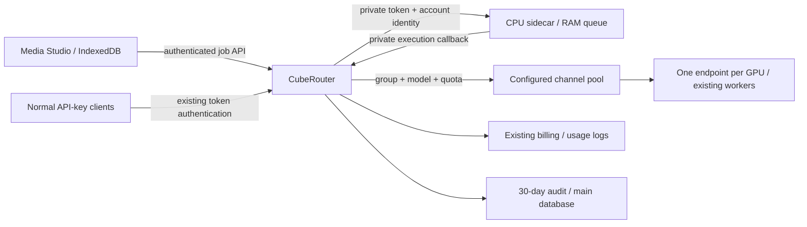

# Qwen Image 2.1 in CubeRouter Media Studio

Opt-in Qwen generation and editing at `/media-studio`, alongside existing image
providers: ten reference images, official examples, freehand colored strokes,
continued editing with retained dimensions, account-isolated browser history,
and a recoverable FIFO queue. Loading an example never starts generation.

[Deployment instructions](DEPLOYMENT.md)



The sidecar schedules work and holds temporary media in RAM. It does not contain
weights, need GPUs or choose the provider. CubeRouter uses existing channels,
group permissions, billing, model mapping and relay. `qwen_channel_bridge.py`
documents the compatible upstream protocol; this image does not install workers.

## Capacity and recovery

- One active job per account; generation and editing share a FIFO queue.
- Up to eight dispatch slots, matching the number of actual GPU channels.
- ONE CubeRouter replica and one dispatcher per pool. In-process reservations
  prevent selecting a busy channel; health is checked before generation. Normal
  API image requests for the configured model use the same reservation pool.
- Defaults: ten waiting jobs, 256 MiB aggregate queue/result data, 16 MiB request
  bodies, 15-minute queue expiry, ten-minute result collection window.
- Refresh looks up an account-scoped idempotency key. Lost responses never cause
  automatic resubmission. A restarted sidecar loses RAM jobs; users must review
  their saved draft before creating a new request.
- Results are acknowledged after the browser history write succeeds. Download
  remains available if local storage fails.

Sharing eight GPUs across two installations does not add capacity. Gateways have
separate reservations/queues; workers reject overlap, so races can fail busy.
Uncertain executions are not retried. Split GPU allocation for simultaneous
site tests or coordinate a cutover. Shared leases/multiple replicas are not provided.

## Storage

| Location | Content | Retention |
| --- | --- | --- |
| Browser IndexedDB, per origin/account | Images, references, prompts, parameters, original/strokes, versions; one recovery draft | Existing limit: 50 jobs / 100 MiB; no timed expiry; browser clearing/eviction can remove it |
| Dispatcher RAM | Waiting inputs and uncollected output | Queue 15 minutes; output ten minutes or acknowledgement; lost on restart |
| Main `SQL_DSN`, `image_studio_audits` | Account, job, user/model prompts, parameters, status, channel, SHA-256 hashes | 30 days; hidden at expiry, purged at startup/every five minutes |
| Existing usage log database | Standard account/model/channel/quota records | Existing operator retention, unchanged |

Audit requires `IMAGE_STUDIO_AUDIT_ENABLED=true` and covers Studio jobs, not all
ordinary API calls. Audit write failures block execution. No image bytes enter
this table. Hashes match exact files, cannot reconstruct images, and identify an
account rather than independently proving a person's identity. Backups have their
own retention policy.

Root administrators use `GET /api/image-studio-audit` with optional `user_id`,
`job_id`, or `output_sha256` filters (latest 50). Use normal authenticated dashboard
API access or an appropriately scoped management credential. Inference API keys
are not administrator credentials. This change does not add an audit dashboard.

## Tests

```bash
python -m unittest discover -s deploy/image-studio -p 'test_*.py'
go test ./controller ./middleware ./model -run 'Test(ImageStudio|Studio|ImageChannel)' -count=1
cd web
bun run typecheck
bun run test src/features/media-studio
bun run build
```

`TestImageStudioDatabaseMatrix` accepts `STUDIO_TEST_MYSQL_DSN` and
`STUDIO_TEST_POSTGRES_DSN` pointing at DISPOSABLE databases. It tests fresh and
representative existing schemas, repeated migration, uniqueness, prompt retention
and expiry; CI supplies both engines in addition to SQLite.
