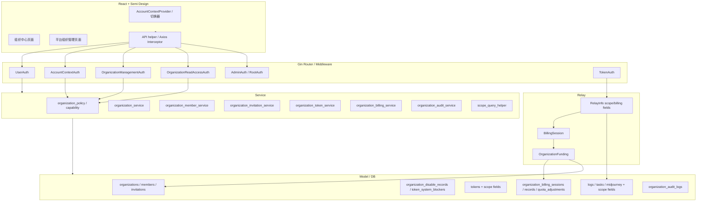
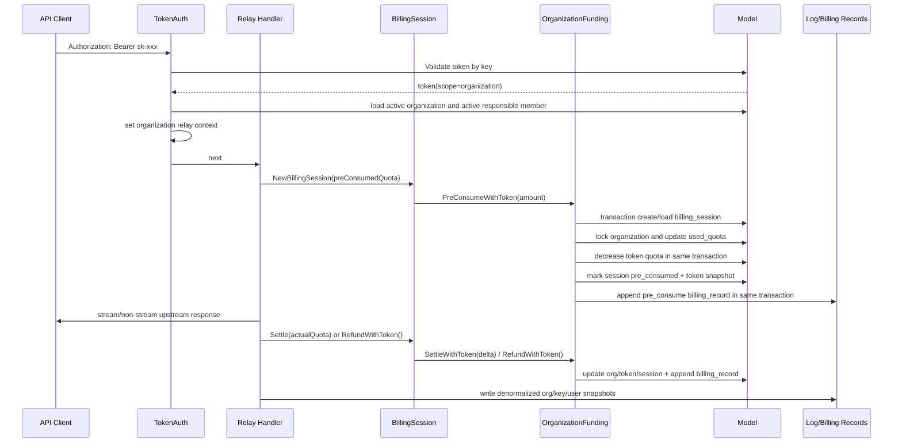
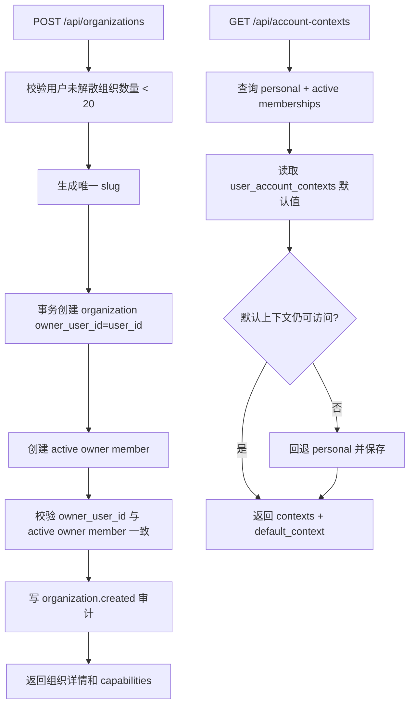

# 组织功能技术方案（新版 PRD 重写版）

> 本技术方案基于 `docs/ORGANIZATION_PRD.md` 编写，用于指导组织功能一期实现。
>
> 组织功能当前尚未正式上线，因此本文档不为当前分支中的旧 workspace 语义、中间态组织接口、旧角色行为或临时兼容逻辑提供兼容承诺。后续实现应以新版 PRD 的产品语义、数据隔离、计费可靠性、权限正确性和审计安全为准。
>
> 需要兼容的是既有线上个人账号能力，而不是当前分支尚未上线的组织功能行为。
>
> `docs/architecture/organization-workspace-v2.md`、`docs/architecture/organization-workspace-schema-v2.md`、`docs/architecture/organization-workspace-api-rbac-tasks-v2.md`、`docs/architecture/review_organization_architecture.md` 已由本技术方案和 `docs/ORGANIZATION_PRD.md` 取代，不再作为实现或验收依据。

## 1. 文档定位与设计目标

### 1.1 目标

一期组织功能需要在不破坏个人账号能力的前提下，引入组织作为独立的协作、权限、资源、计费、日志、任务、用量和审计边界。

核心目标：

- 支持用户创建组织，并作为唯一 active owner 管理组织。
- 支持个人空间和组织空间的请求级 Account Context 隔离。
- 支持组织成员、邀请、owner 转交、成员移除/退出和 Key 处理（public 转交/private 删除）。
- 支持组织 API Key，组织 Key Relay 只消耗组织额度和 Key 限额，不消耗责任人个人额度、订阅、钱包或 trust quota。
- 支持组织计费 session/records，保证预扣、结算、退款、修复和并发消费幂等可靠。
- 支持组织日志、任务、用量与额度流水、审计的组织级和责任人级隔离。
- 支持平台 admin/root 管理组织、成员、Key、额度、审计和高风险生命周期动作。
- 支持 SQLite、MySQL、PostgreSQL 的迁移和运行。

### 1.2 非目标

一期不实现：

- Project / 项目空间。
- 自定义角色。
- Service Account / 机器身份。
- SSO、SCIM、域名验证。
- 链接邀请、多次使用邀请。
- 组织独立充值订单、发票、订阅支付闭环。
- 成员硬性预算或成员额度分配。
- 个人与组织之间余额、订阅、历史日志、Key 的迁移。
- 组织日志完整 prompt/response 内容授权查看。
- Key 细粒度权限策略，如只读 Key、接口级权限或复杂 RBAC。

### 1.3 设计原则

1. 新版 PRD 的产品语义优先。
2. 数据隔离、权限正确性、计费可靠性和审计安全优先。
3. 只兼容线上个人账号能力，不兼容未上线的组织中间态行为。
4. 后端 capability 是权限事实源，前端隐藏按钮不是权限边界。
5. Account Context Header 是单次业务请求事实源，用户默认上下文只用于前端初始化。
6. Relay 组织 Key 不依赖前端 Header，而由 TokenAuth 根据 token scope 注入组织计费上下文。
7. 组织计费正式开放前必须具备 billing session/records，不允许回退到直接更新 `organizations.used_quota` 的旧路径。
8. 跨数据库兼容优先，不依赖 partial unique index 或 nullable unique 的数据库差异。
9. 审计 JSON 和幂等结果 JSON 使用项目封装，例如 `common.Marshal`、`common.Unmarshal`。

## 2. 当前代码处理策略

### 2.1 可复用资产

当前分支已有组织中间态实现，可复用以下方向：

| 资产 | 复用方式 |
|---|---|
| `organizations` 基础表 | 保留组织名称、slug、状态、额度、创建者等基础字段，补齐 owner、禁用来源、解散快照。 |
| `organization_members` | 保留成员唯一性和生命周期字段，重构角色为 owner/admin/member。 |
| `organization_invitations` | 保留邮箱邀请、状态、过期、接受/撤销能力，替换 raw token 为 token hash。 |
| `organization_audit_logs` | 保留审计模型，扩展动作范围、操作者快照、目标快照和脱敏规则。 |
| `tokens` scope 字段方向 | 复用 `scope_type/scope_id/organization_id/creator_user_id/responsible_user_id/visibility`，强化责任人与计费语义。 |
| `logs/tasks` scope 字段方向 | 复用 scope、billing account、organization、actor、creator、responsible 字段方向。 |
| `service/account_context.go` | 保留上下文列表和默认上下文能力，改为请求 Header 逐次校验。 |
| 组织 Key service 雏形 | 保留单个/批量创建、列表、更新、删除、转交的业务骨架，补齐 capability、幂等、cache 失效。 |
| 组织禁用批量禁用 Key 思路 | 保留系统禁用思路，升级为多来源 blocker 和安全恢复。 |
| 前端页面雏形 | 可复用布局和服务封装，但接口、权限、disabled/dissolved 行为按新版 PRD 调整。 |

### 2.2 必须替换或删除的旧实现

后续实现应主动清理：

- 旧 workspace header、workspace 命名和 workspace 语义。
- 创建组织后创建者为 admin 的行为。
- 只服务 admin/member 的 last admin 保护逻辑。
- 只依赖 member role 判断 owner 的逻辑。
- 邀请 raw token 持久化路径。
- 直接扣组织 `used_quota` 且无 session/record 的计费入口。
- 绕过 capability service 的 controller/service 局部角色判断。
- 只靠前端隐藏按钮控制权限的页面逻辑。
- 与新版 RESTful API 冲突且无业务必要的动作式接口。
- 无法保证 Redis token cache 一致性的 Key 更新路径。
- 审计中可能落入完整 Key secret、邀请明文 token、token ciphertext、prompt/response 的路径。

### 2.3 重构边界

- 如果旧代码复用会导致权限、计费、审计或数据隔离逻辑分散，应优先重构为统一 policy、billing、audit、scope helper。
- 如果旧接口尚未上线且与新版 API 冲突，应删除或替换，不保留兼容层。
- 如果旧字段可作为兼容字段保留，例如组织 Key 的 `tokens.user_id=responsible_user_id`，必须明确其不代表个人计费账户。

## 3. 总体架构

### 3.1 分层

```text
Frontend
  AccountContextProvider
  Axios interceptor
  Organization Center
  Admin Organization Management

Router / Middleware
  UserAuth
  AdminAuth / RootAuth
  AccountContextAuth
  OrganizationManagementAuth
  OrganizationReadAccessAuth
  TokenAuth

Controller
  account_context
  organization
  organization_member
  organization_invitation
  organization_token
  organization_usage
  admin_organization

Service
  organization_policy
  organization_service
  organization_member
  organization_invitation
  organization_token
  organization_billing
  organization_audit
  scope_query
  idempotency

Model
  organizations
  organization_members
  organization_invitations
  organization_disable_records
  organization_token_system_blockers
  organization_idempotency_records
  organization_billing_sessions
  organization_billing_records
  organization_audit_logs
  tokens/logs/tasks/midjourney scope fields

Relay
  TokenAuth
  RelayInfo
  BillingSession
  OrganizationFunding
```

### 3.2 Middleware 边界

| Middleware | 适用范围 | 规则 |
|---|---|---|
| `AccountContextAuth` | active 组织工作区资源 | 必须校验 Header 为 organization，Header id 等于 path organization id，当前用户是 active member，组织 active。 |
| `OrganizationManagementAuth` | active/disabled 普通组织生命周期管理 | 按 path organization id 校验 active owner/admin，不依赖 Account Context Header；platform role 不提升、不兜底。 |
| `OrganizationReadAccessAuth` | `/api/organizations/*` 普通 GET 入口 | 先读取组织状态：active 必须校验 Account Context 并选择 `workspace`；disabled 选择 `read_only`，且仅 active membership 的 owner/admin 可进入；dissolved 普通入口统一返回 410。调用方不能为 active 组织直接指定 `read_only`。 |
| `OrganizationAdminAuth` + `AdminAuth/RootAuth` | `/api/admin/organizations/*` | 仅按 platform admin/root 授权，不依赖 Account Context Header，即使收到 Header 也忽略；organization membership 不降级平台权限。 |
| `TokenAuth` | Relay | 根据 token scope 注入 personal 或 organization billing context。 |

### 3.3 Gin Context 字段

普通业务请求：

| Key | 类型 | 说明 |
|---|---|---|
| `account_scope_type` | string | `personal` 或 `organization`。 |
| `account_scope_id` | int | personal=user id，organization=organization id。 |
| `organization_id` | int | 当前组织 id，仅组织上下文有值。 |
| `organization_role` | string | owner/admin/member。 |
| `organization_capabilities` | []string | 当前用户在该访问模式下的能力。 |
| `organization_access_mode` | string | workspace/management/read_only/admin。 |

普通入口的 `organization_role` 和审计操作者角色均来自 active organization membership；`admin` 入口的角色与审计操作者角色均来自 platform role。controller 必须把可信的 `organization_access_mode` 显式传入 service，service 再显式传入事务内 helper，任何层都不得根据全局角色、membership 或缺省值重新推断、promotion 或 fallback。

Relay 组织 Key：

| Key | 类型 | 说明 |
|---|---|---|
| `token_scope_type` | string | personal/organization。 |
| `organization_id` | int | 组织 Key 所属组织。 |
| `responsible_user_id` | int | 当前责任人。 |
| `creator_user_id` | int | Key 创建者。 |
| `billing_account_type` | string | personal/organization。 |
| `billing_account_id` | int | user id 或 organization id。 |

### 3.4 RelayInfo 扩展

`RelayInfo` 必须包含：

- `ScopeType`
- `ScopeID`
- `OrganizationID`
- `BillingAccountType`
- `BillingAccountID`
- `ActorUserID`
- `CreatorUserID`
- `ResponsibleUserID`
- `TokenID`
- `TokenName`
- `RequestID`
- `TaskID`
- `Group`

组织 Key 下：

- `BillingAccountType=organization`
- `BillingAccountID=organization_id`
- `ActorUserID=responsible_user_id`
- `tokens.user_id` 仍可作为兼容责任人字段，但不能用于个人计费。

### 3.5 新增或改造文件

| 层 | 建议文件 | 职责 |
|---|---|---|
| router | `router/organization-router.go` | 注册普通组织只读/管理、工作区、管理端组织路由。 |
| middleware | `middleware/account_context.go` | 校验 `X-Account-Context-*`，写入 gin context。 |
| middleware | `middleware/organization_management.go` | 校验 active/disabled 组织的 path 级管理权限，不依赖 Account Context。 |
| middleware | `middleware/auth.go` | 扩展 `TokenAuth` 识别组织 Key，写入 Relay scope/billing context。 |
| controller | `controller/organization.go` | 组织生命周期、详情、只读入口。 |
| controller | `controller/organization_member.go` | 普通组织成员列表、更新、移除、退出、owner 转交；不提供直接添加。 |
| controller | `controller/organization_invite.go` | 邀请创建、列表、`force_rotate=true` 重复邀请、撤销、接受。 |
| controller | `controller/organization_token.go` | 组织 Key 单个/批量 CRUD、转交。 |
| controller | `controller/organization_data.go`、`controller/organization_log.go`、`controller/organization_billing.go`、`controller/organization_audit.go` | 组织日志、任务、用量摘要、额度流水、审计查询。 |
| controller | `controller/organization.go`、`controller/organization_member.go`、`controller/organization_token.go` | 普通组织与平台组织管理共用控制器，平台边界由 `/api/admin/*` middleware/capability 强制。 |
| service | `service/account_context.go` | 当前上下文读取、保存、回退。 |
| service | `service/organization_policy.go` | capability 统一判断。 |
| service | `service/organization.go` | 生命周期状态机、禁用/启用/解散。 |
| service | `service/organization_member.go` | 成员状态机、自动 Key 转交。 |
| service | `service/organization_invite.go` | 邀请 token、TTL、规范化邮箱严格匹配和投递状态机。 |
| service | `service/organization_token.go` | 组织 Key 可见性、批量幂等、缓存失效。 |
| service | `service/organization_billing.go` | 组织 funding source、token-aware 计费、session 状态机、额度调整、流水。 |
| service | `service/organization_audit.go` | 审计日志写入、脱敏。 |
| service/model | `service/organization_log.go`、`service/organization_task.go`、`model/async_task_scope.go` | 日志、任务和 Midjourney 的 scope 查询与 ID 级授权。 |
| model | `model/organization*.go` | 组织相关表模型与查询。 |
| dto | `dto/organization*.go` | 请求/响应 DTO。 |

### 3.6 架构与核心链路图

整体架构：



组织 Key Relay 核心链路：



组织创建与 Account Context 初始化链路：



## 4. 数据模型设计

### 4.1 organizations

| 字段 | 说明 |
|---|---|
| `id` | 组织 id。 |
| `name` | 名称。 |
| `slug` | 全局唯一 slug。 |
| `description` | 描述。 |
| `group` | 组织可用 group。 |
| `status` | active/disabled/dissolved。 |
| `quota` | 总额度，生产默认 0。 |
| `used_quota` | 已占用额度，包含已结算消费和进行中预扣。 |
| `request_count` | 已结算成功请求数。 |
| `owner_user_id` | 当前 owner 主事实源。 |
| `created_by` | 创建者。 |
| `created_at/updated_at` | 时间戳。 |
| `dissolved_at` | 解散时间。 |

约束：

- 创建组织默认 `quota=0`，开发/测试可通过配置覆盖。
- 创建者成为 active owner。
- `organizations.owner_user_id` 是 owner 唯一主事实源。
- `organization_members.role=owner` 是展示、查询和权限计算冗余字段，必须与 `owner_user_id` 同事务维护。
- owner 转交、platform root 修复、禁用、启用、解散、额度预扣和额度调整均以 organization 行为事务串行化入口。
- 每个用户最多创建 20 个未解散组织，超过返回 `organization_limit_exceeded`。

跨数据库锁策略：

- PostgreSQL/MySQL 使用 GORM transaction + row lock 锁定 `organizations` 行，再更新 members/tokens/billing session。
- SQLite 不支持等价 `SELECT FOR UPDATE`，使用同一 transaction 内的条件更新作为串行化点，例如 `UPDATE organizations SET updated_at=updated_at WHERE id=? AND owner_user_id=?`，并检查 affected rows。
- 所有 owner 转交、额度预扣、额度调整、禁用/启用/解散都必须以 organization 行为锁入口，避免 members/tokens 各自加锁导致死锁或并发不一致。

### 4.2 organization_members

| 字段 | 说明 |
|---|---|
| `id` | 成员记录 id。 |
| `organization_id` | 组织 id。 |
| `user_id` | 用户 id。 |
| `role` | owner/admin/member。 |
| `status` | active/disabled/exited/removed。 |
| `joined_at` | 加入时间。 |
| `last_active_at` | 最近活跃。 |
| `created_at/updated_at` | 时间戳。 |

约束：

- `(organization_id, user_id)` 唯一。
- 同一用户退出或被移除后再次加入，复用原记录并恢复 active。
- 每个组织同一时间只能有一个 active owner，以 `organizations.owner_user_id` 为主事实保证。
- owner 不能被 admin 禁用、移除、降级或直接退出。
- active admin 降级为 member 前，事务内锁定其负责的 public Key 并按 id 顺序转移给显式 active owner/admin，未指定时只使用 `organizations.owner_user_id`；private Key 保持不变。转移失败时角色和 Key 归属整体回滚。
- 成员禁用时，其负责的全部未删除组织 Key 保留责任人，通过 `member_disabled` system blocker 暂时禁用并在成员启用后恢复原状态；成员移除或退出时，public Key 自动转交责任人（无合法目标则操作失败），private Key 软删除。

### 4.3 organization_invitations

| 字段 | 说明 |
|---|---|
| `id` | 邀请 id。 |
| `organization_id` | 组织 id。 |
| `target_email` | 规范化邮箱。 |
| `role` | admin/member。 |
| `token_hash` | 邀请 token hash，唯一。 |
| `status` | pending/accepted/revoked/expired。 |
| `invited_by` | 邀请人。 |
| `accepted_user_id` | 接受用户。 |
| `accepted_at` | 接受时间。 |
| `expires_at` | 过期时间。 |
| `delivery_status` | pending/sent/failed；旧版本已发送记录迁移为 sent。 |
| `delivery_attempts` | 投递尝试次数。 |
| `last_delivery_error` | 已脱敏并截断的最近投递错误。 |
| `delivered_at` | 最近成功投递时间。 |
| `created_at/updated_at` | 时间戳。 |

约束：

- 明文 token 只在创建/重发时生成并发送，不落库。
- 重发邀请必须 rotate token_hash，旧 token 立即失效。
- 创建邀请和接受邀请使用同一 `NormalizeEmail` helper：`strings.TrimSpace` + lowercase。
- 接受邀请时当前登录用户规范化邮箱必须等于 `target_email`。
- 不做 Gmail dot/plus 或 provider-specific 归一。
- 邀请不能创建 owner。
- 创建/重发分两阶段：第一阶段按 organization → invitation → idempotency 锁序持久化 token hash、pending delivery、审计和幂等进度并提交；第二阶段重新按相同资源顺序锁定、校验生命周期和 token hash 后发送邮件并标记 sent。
- SMTP 失败在独立事务中标记 failed；返回和持久化前都必须移除 raw token。幂等记录只保存 invitation id，不保存明文 token。
- 接受邀请按 organization → invitation 锁序，并使用 `WHERE id=? AND status=pending` 条件更新；并发接受只能有一个成功。

### 4.4 user_account_contexts

| 字段 | 说明 |
|---|---|
| `user_id` | 用户 id，主键。 |
| `context_type` | personal/organization。 |
| `context_id` | user id 或 organization id。 |
| `updated_at` | 更新时间。 |

该表只保存默认上下文，用于前端初始化。每个业务请求都必须按 `X-Account-Context-*` Header 重新校验。

### 4.5 organization_disable_records

为支持 self disabled 与 platform disabled 并存，建议新增禁用记录表，而不是使用单个覆盖式 `disabled_source` 字段。

| 字段 | 说明 |
|---|---|
| `id` | 记录 id。 |
| `organization_id` | 组织 id。 |
| `source` | self/platform。 |
| `status` | active/cleared。 |
| `disabled_by_user_id` | 禁用操作者。 |
| `disabled_reason` | 禁用原因。 |
| `disabled_at` | 禁用时间。 |
| `cleared_by_user_id` | 解除操作者。 |
| `cleared_reason` | 解除原因。 |
| `cleared_at` | 解除时间。 |
| `created_at/updated_at` | 时间戳。 |

规则：

- 组织状态 `disabled` 由 active disable records 推导并落到 `organizations.status` 便于查询。
- platform disabled 优先级高于 self disabled。
- platform disabled 未解除前，owner/admin 不能自助启用组织。
- 解除某个来源只清除对应 record；如果仍存在其他 active disable record，组织继续保持 disabled。
- 每次禁用/启用都写审计。

### 4.6 organization_token_system_blockers

为支持组织状态、成员状态、组织解散等多来源系统禁用，建议新增 blocker 表。

| 字段 | 说明 |
|---|---|
| `id` | blocker id。 |
| `token_id` | Key id。 |
| `organization_id` | 组织 id。 |
| `reason` | organization_self_disabled / organization_platform_disabled / member_disabled / organization_dissolved 等。 |
| `ref_type` | organization/member/system。 |
| `ref_id` | 触发来源 id。 |
| `status` | active/cleared。 |
| `previous_status` | 新增 blocker 前 Key 状态快照。 |
| `operator_user_id` | 操作者或 0 表示系统。 |
| `disabled_at` | 禁用时间。 |
| `cleared_at` | 清除时间。 |
| `created_at/updated_at` | 时间戳。 |

`tokens` 表仍可保留派生字段用于快速查询：

- `disabled_by_system`
- `system_disabled_reason`
- `system_disabled_ref_id`
- `system_disabled_at`
- `previous_status`

但恢复判断必须以 active blockers 重新计算为准。

恢复规则：

- reconcile 在派生 Key 状态前先验证每个 active blocker 的来源。`member_disabled` 与 `user_platform_disabled` 还必须满足 `ref_id` 等于 Key 当前 `responsible_user_id`（仅该字段为 0 时回退 `user_id`）；责任人不匹配时立即清为 cleared。
- 解除某一系统原因时，只清除匹配 reason/ref 的 blocker。
- 清除后重新计算该 Key 是否仍有 active blocker。
- 只有不存在 active blocker，且 Key 原状态可恢复时，才允许恢复。
- 手动禁用 Key 不自动恢复。
- `organization_dissolved` 是终态 blocker，不允许恢复。
- blocker 新增、清除和重新计算后必须失效 Redis token cache。

### 4.7 tokens 扩展

组织 Key 复用 `tokens` 表。

| 字段 | 说明 |
|---|---|
| `scope_type` | personal/organization。 |
| `scope_id` | personal=user_id，organization=organization_id。 |
| `organization_id` | 组织 id。 |
| `creator_user_id` | 创建者。 |
| `responsible_user_id` | 当前责任人。private Key 责任人可为任意 active 成员；public Key 责任人必须是组织 owner 或 admin。 |
| `visibility` | private/public。private：仅责任人可见；public：组织内成员可见。member 只能创建/担任 private Key 责任人。 |
| `transfer_reason` | 最近转交原因。 |
| `disabled_by_system` | 是否存在系统禁用。 |
| `system_disabled_reason` | 派生主原因。 |
| `system_disabled_ref_id` | 派生来源 id。 |
| `system_disabled_at` | 系统禁用时间。 |
| `previous_status` | 系统禁用前状态快照。 |

兼容规则：

- 个人 Key：`scope_type=personal`、`scope_id=user_id`、`organization_id=0`。
- 组织 Key：`scope_type=organization`、`scope_id=organization_id`、`organization_id=organization_id`、`user_id=responsible_user_id`。
- `tokens.user_id` 不代表组织 Key 的个人计费账户。
- 组织 Key 的 `UnlimitedQuota=true` 只旁路 Key 自身 `remain_quota` 校验和扣减，不旁路组织额度校验；Key `used_quota` 仍记录实际用量。

### 4.8 organization_idempotency_records

高风险组织写操作使用统一幂等记录。账务请求使用 billing sessions，不使用该表。

覆盖操作：

- 批量创建 Key。
- 批量删除 Key。
- 额度调整外的高风险写操作。
- 邀请 `force_rotate=true` 重复邀请。
- 成员移除/退出导致的批量 Key 转交。
- owner 转交。

| 字段 | 说明 |
|---|---|
| `id` | 记录 id。 |
| `organization_id` | 组织 id。 |
| `operation_type` | 操作类型。 |
| `idempotency_key` | 客户端 `Idempotency-Key`，非空唯一。 |
| `request_hash` | 规范化请求体 hash。 |
| `status` | processing/succeeded/failed。 |
| `result_json` | 可重复返回的安全结果摘要。 |
| `error_code` | 失败错误码。 |
| `created_by` | 操作者。 |
| `expires_at` | 可清理时间。 |
| `created_at/updated_at` | 时间戳。 |

约束：

- 同一 idempotency key 命中已有记录时，校验 `organization_id + operation_type + request_hash`。
- 任一不一致返回 `organization_idempotency_conflict`。
- `result_json` 只保存 token id 等摘要，不保存 Key secret、邀请明文 token 或其他敏感凭证；完整 secret 在响应时从 token 行现取。
- 批量创建 Key 首次成功响应与幂等重试均返回完整 secret（`secret_available=true`）；组织 Key 完整 secret 在列表、详情、更新、转交、批量幂等重试中按操作者权限每次返回，masked key 预览（`key_preview`）用于安全展示。

### 4.9 organization_billing_sessions

组织 Relay 请求必须创建持久化 session。

| 字段 | 说明 |
|---|---|
| `id` | session id。 |
| `organization_id` | 组织 id。 |
| `idempotency_key` | 非空唯一，如 `request:{request_id}` 或 `task:{task_id}`。 |
| `request_id` | Relay 请求 id。 |
| `task_id` | 异步任务 id。 |
| `status` | pre_consumed/repairing/settled/refunded/failed。 |
| `pre_consumed_quota` | 预扣组织额度。 |
| `settled_quota` | 实际结算组织额度。 |
| `refunded_quota` | 已退组织额度。 |
| `token_pre_consumed_quota` | Key 用量预扣或记录快照。 |
| `token_remain_deducted_quota` | 实际扣减的 Key remain_quota。 |
| `token_unlimited_quota` | 预扣时 Unlimited 快照。 |
| `token_refunded` | Key 额度是否已恢复。 |
| `token_id/token_name` | Key 快照。 |
| `responsible_user_id` | 责任人。 |
| `creator_user_id` | 创建者。 |
| `model_name` | 模型。 |
| `group` | group 快照。 |
| `error_message` | 错误原因。 |
| `repair_attempts` | 修复次数。 |
| `last_repair_error` | 最近修复错误。 |
| `last_heartbeat_at` | 流式或异步任务活跃时间。 |
| `expires_at` | 可被修复任务接管时间。 |
| `settled_at/refunded_at` | 终态时间。 |
| `created_at/updated_at` | 时间戳。 |

约束：

- 同一 `idempotency_key` 重试必须校验 organization、token、request/task 完全一致。
- 冲突返回 `organization_billing_session_conflict`。
- 预扣、结算、退款在原账务事务内更新额度、session 状态并追加不可变流水；任一步失败整笔回滚。
- 解散组织前必须检查未终态 session。

### 4.10 organization_billing_records

| 字段 | 说明 |
|---|---|
| `id` | 流水 id。 |
| `organization_id` | 组织 id。 |
| `session_id` | 对应 session，调整类可为空。 |
| `record_key` | 非空唯一，如 `pre_consume:{session_id}`、`settle:{session_id}`、`refund:{session_id}`、`adjust:{idempotency_key}`。 |
| `request_id/task_id` | 请求或任务 id。 |
| `record_type` | pre_consume/settle/refund/adjustment。 |
| `quota_delta` | 对总额度影响，仅 adjustment 使用。 |
| `used_quota_delta` | 余额流水金额，即本条记录对 `used_quota` 的影响。 |
| `usage_quota` | 消费汇总金额；预扣和纯预扣退款为 0，settle 为实际消费，结算后退款为负退款额。 |
| `quota_before/quota_after` | 总额度快照。 |
| `used_quota_before/used_quota_after` | 已用额度快照。 |
| `token_id/token_name` | Key 快照。 |
| `responsible_user_id/creator_user_id` | 用户快照。 |
| `model_name/group` | 模型和 group。 |
| `prompt_tokens/completion_tokens/token_count` | token 统计。 |
| `created_at` | 记录时间。 |

规则：

- pre_consume、settle、refund 必须分别追加新流水，不能改写已有流水；预扣额为 0 时不写空流水。
- 月度用量按 `created_at` 所在月份聚合。
- 跨月退款进入退款发生月份。
- 纯预扣退款不计入消费；历史 refund 只有在同组织、同 session 存在 settle 时才参与消费汇总。
- adjustment 只影响额度调整展示，不计入模型消费 tokens。

### 4.11 organization_quota_adjustments

平台额度调整写独立表，并追加 billing record。

| 字段 | 说明 |
|---|---|
| `id` | 调整 id。 |
| `organization_id` | 组织 id。 |
| `quota_delta` | 调整额度。 |
| `quota_before/quota_after` | 调整前后总额度。 |
| `used_quota` | 调整前已占用额度快照。 |
| `operator_user_id` | 操作者。 |
| `reason` | 原因。 |
| `idempotency_key` | 非空唯一。 |
| `created_at` | 创建时间。 |

约束：

- 调整后必须满足 `quota_after >= used_quota`。
- 同一 idempotency key 重试必须校验 organization、quota_delta、reason 一致。
- 冲突返回 `organization_idempotency_conflict`。
- 额度调整以 organization 行锁作为串行化入口；不同 idempotency key 的并发增量必须全部保留。

### 4.12 logs/tasks/midjourney 扩展

新增字段方向：

- `scope_type/scope_id`
- `billing_account_type/billing_account_id`
- `organization_id`
- `actor_user_id`
- `creator_user_id`
- `responsible_user_id`
- `creator_name`
- `responsible_name`
- `token_id/token_name`
- `group`
- `request_id`
- `organization_name`
- `organization_billing_session_id` 或可稳定反查 session 的 idempotency key

`LOG_SQL_DSN` 独立日志库场景不得依赖 join 主库 users 表，展示和筛选所需字段必须在写日志时冗余。

Task/Midjourney 的 ID 和 batch ID 查询统一使用 `(user_id, scope_type, scope_id, billing_account_type, billing_account_id, organization_id)`。personal 强制 `organization_id=0`；organization 强制三个组织标识一致。fetch/change/remix/image seed 均不得仅凭任务 ID 授权。

### 4.13 organization_audit_logs

| 字段 | 说明 |
|---|---|
| `id` | 审计 id。 |
| `organization_id/name/slug` | 组织快照。 |
| `operator_user_id/username/display_name/role` | 操作者快照。 |
| `action_type` | 动作类型。 |
| `target_type/id/name` | 目标快照。单 Key `target_type=token` 时 `target_id` 是稳定的 Key 主标识；批量转交等聚合事件可使用 `target_id=0` 并记录数量快照。 |
| `target_metadata` | 脱敏元数据 JSON。Key 目标至少包含操作时的名称、masked key preview、责任人/创建者、状态和 visibility 快照；不得包含完整 secret。 |
| `before_data` | 脱敏前值 JSON。 |
| `after_data` | 脱敏后值 JSON。 |
| `reason` | 原因。 |
| `ip/user_agent` | 请求信息。 |
| `created_at` | 创建时间。 |

审计不得记录：

- 完整 Key secret。
- 邀请明文 token。
- token ciphertext。
- 完整 prompt/response。
- 其他敏感凭证。

失败审计动作：

- `organization.member.key_transfer_blocked`：成员状态/Key 责任人事务回滚后，在独立事务记录 blocker。
- `organization.billing.repair_failed`：repair session 标记 failed 后，以 `operator_user_id=0`、`operator_role=system` 记录 session id 和脱敏错误摘要。
- 失败审计为 best-effort；写入失败只调用 `common.SysError`，不得替换原 blocker、鉴权或 repair 错误。

Key 审计读取契约：单 Key 事件的 `target_id` 用于精确定位 Key；名称和 masked preview 仅来自操作时的审计快照，聚合事件使用数量/变更快照。审计查询、平台审计查询和前端审计详情不得从当前或 `Unscoped` 的 token 记录回填或返回完整 Key secret。Key 被转交或软删除后，原审计快照保持不变。

## 5. 权限与 Capability

### 5.1 角色

组织角色：

- owner
- admin
- member

平台角色：

- platform admin
- platform root

owner 规则：

- `organizations.owner_user_id` 是唯一主事实源。
- member role 的 owner 是冗余字段。
- 创建组织的用户自动成为 active owner。
- owner 转交目标必须是本组织 active admin 或 active member。
- 转交成功后，新 owner 写入 `owner_user_id`，原 owner 自动降级为 admin。
- owner 不能被 admin 禁用、移除、降级或直接退出。
- platform root 可修复或转交 owner。
- platform admin 非 root 不能管理 owner。

### 5.2 AccessMode

| AccessMode | 说明 |
|---|---|
| `workspace` | active 组织工作区资源，必须 Account Context Header 与 path 一致，只接受 active owner/admin/member。 |
| `management` | active/disabled 普通组织生命周期管理，不依赖 Header，只接受 active owner/admin。 |
| `read_only` | 仅限 disabled 普通组织只读入口，只接受 active membership 的 owner/admin；active 输入 fail closed，member 无进入 capability，dissolved 统一拒绝并返回 410。 |
| `admin` | 平台组织管理端，只接受 platform admin/root；organization membership 不参与授权，dissolved 只读。 |

### 5.3 Capability 建议

- `CanViewOrganization`
- `CanUpdateOrganization`
- `CanDisableOrganization`
- `CanEnableOrganization`
- `CanDissolveOrganization`
- `CanViewMembersFull`
- `CanViewMembersLimited`
- `CanManageMembers`
- `CanTransferOwner`
- `CanManageInvitations`
- `CanViewOrganizationTokens`
- `CanManageOrganizationTokens`
- `CanCreatePublicOrganizationToken`
- `CanViewOrganizationLogs`
- `CanViewOrganizationUsage`
- `CanViewOrganizationAuditLogs`
- `CanAdjustOrganizationQuota`
- `CanViewReadOnlyOrganization`

### 5.4 成员管理矩阵

owner/admin/member 行只适用于普通组织模式，platform admin/root 行只适用于 `admin` 模式；同一用户切换入口时必须重新按对应 `AccessMode` 取角色，不能合并两行能力。

| 操作者 | 目标 | 允许 | 禁止 |
|---|---|---|---|
| owner | admin/member | 移除、禁用、启用、admin/member 互转 | 通过 PATCH 创建 owner。 |
| owner | owner | owner-transfer | 禁用、移除、退出、降级。 |
| admin | member | 移除、禁用、启用、member 提升为 admin | 管理现有 admin/owner，创建 owner，解散组织。 |
| admin | admin/owner | 无 | 修改 role/status、移除、禁用。 |
| platform admin | admin/member | 添加、移除、禁用、启用、admin/member 互转 | 管理 owner、解散组织、owner-transfer。 |
| platform admin | owner | 无 | 修改 role/status、移除、禁用。 |
| platform root | owner/admin/member | 转交或修复 owner、添加、移除、禁用、启用 | 制造多个 active owner。 |
| member | 任意 | limited 成员列表 | 任何成员写操作。 |

邀请操作的目标是未入组用户，不属于上述现有成员目标矩阵：owner/admin 可将用户邀请为 member 或 admin，但不能通过邀请创建 owner。

### 5.5 Policy 输入模型

`service/organization_policy.go` 应统一接收结构化输入，避免 controller、middleware、service 各自拼权限条件。

```text
PolicyInput
├── CurrentUser: id, platformRole
├── Organization: id, status, owner_user_id
├── DisableState: active_sources[], effective_source, can_self_enable
├── Member: role, status
├── Resource: type, owner/responsible ids, visibility
└── AccessMode: workspace | management | read_only | admin
```

说明：

- 角色来源由 `AccessMode` 唯一决定：`workspace`、`management`、`read_only` 只读取 active organization membership，并使用 owner/admin/member；`admin` 只读取 platform role，并使用 platform_admin/platform_root。
- platform admin/root 在普通模式无 active membership 时拒绝，作为 member 时不提升；在 `admin` 模式下重叠 membership 只作为资源元数据保留，不能降级或替换平台 capability。
- `DisableState` 来自 `organization_disable_records` 的 active records 聚合，不使用单个覆盖式 `disabled_source` 作为事实源。
- `effective_source` 只用于展示和前端提示，权限判断必须能识别 self/platform 多来源并存。
- `workspace` mode 必须要求 organization active、member active、Header/path 一致。
- `management` mode 仅 active owner/admin 可访问 active/disabled 组织，写操作仍按 capability 和禁用来源判断。
- 真实普通 GET 入口由 `OrganizationReadAccessAuth` 按状态选择模式：active → `workspace`，disabled → `read_only`，dissolved → 普通入口 410；controller 或 service 调用方不能自行把 active 请求指定为 `read_only`。
- `read_only` mode 只允许 active membership 的 owner/admin 查看 disabled 组织，不允许写操作或导出；active 输入 fail closed，member、platform non-member 和 dissolved 普通入口均拒绝。
- `admin` mode 忽略 Account Context，只按平台角色和目标资源状态判断；dissolved 可读，但任何写入必须返回 HTTP 410 和 `organization_dissolved`。
- controller → service → transaction 必须显式传递同一个 `AccessMode`；禁止运行时 promotion、旧 wrapper 缺省模式和按全局角色的 fallback。

## 6. Account Context

### 6.1 请求协议

普通业务请求由前端注入：

```text
X-Account-Context-Type: personal | organization
X-Account-Context-Id: <user_id | organization_id>
```

后端规则：

- Header 缺省时默认 personal。
- personal id 必须等于当前登录用户 id。
- organization id 必须是当前用户 active member 所属 active organization。
- 访问组织工作区资源时 Header organization id 必须等于 URL path organization id。
- Header 与 path 不一致返回 `organization_context_mismatch`。
- disabled 组织不能作为 Account Context。
- dissolved 组织不能作为 Account Context。
- 平台管理端 `/api/admin/*` 不依赖 Header。
- Relay 组织 Key 不依赖 Header。

### 6.2 API

| 方法 | 路径 | 说明 |
|---|---|---|
| GET | `/api/account-contexts` | 返回 personal、可用 active organization、默认上下文。 |
| PUT | `/api/account-contexts/current` | 保存用户默认上下文。 |

默认上下文失效时回退 personal，并可更新 `user_account_contexts`。

## 7. 核心业务流程

### 7.1 创建组织

1. 校验用户登录。
2. 校验组织名称。
3. 统计当前用户未解散组织数量，不超过 20。
4. 生成唯一 slug。
5. 事务创建 organization，`quota` 使用生产默认 0 或环境配置覆盖。
6. 写入 `owner_user_id=creator_user_id`。
7. 创建 active owner member。
8. 校验 `owner_user_id` 与 active owner member 一致。
9. 写审计 `organization.created`。
10. 返回组织详情和 capabilities。

#### 7.1.1 更新组织

1. 校验 operator 具备 `CanUpdateOrganization`。
2. 校验组织非 dissolved。
3. 校验 `name` 非空且非纯空格（trim 后），长度 ≤ 64；`description` 可不填。
4. platform admin/root 更新时必须填写 `reason`。
5. 仅 platform admin/root 可修改 `group`（组织侧无入口）。
6. 事务内更新 `name`/`description`（/`group`），写审计 `organization.updated`。

### 7.2 接受邀请

1. 接收明文 token。该路由是 token auth 例外，不要求调用者预先具有 organization membership，也不从普通/平台入口推断 `AccessMode`。
2. 预读 token hash 对应的 `organization_id`，事务内先锁 organization，再锁 invitation。
3. 校验 invitation pending/未过期、组织 active，并使用同一 NormalizeEmail 校验当前用户邮箱等于 `target_email`。
4. 以 `WHERE id=? AND status=pending` 条件更新 invitation 为 accepted，写 `accepted_user_id/accepted_at`；影响行数必须为 1。
5. 条件状态转换成功后 upsert member，恢复或创建 active member。
6. 成员落库后，以新 active membership 的 owner/admin/member 组织角色和显式 `workspace` mode 写审计 `organization.invite.accept`。任一步失败时 invitation/member/audit 同事务回滚。

### 7.3 Owner 转交

1. 校验 operator 具备 `CanTransferOwner`。
2. 校验目标是 active admin/member。
3. 事务锁定 organization 行。
4. 锁定组织 active members。
5. 校验当前 `owner_user_id` 对应唯一 active owner member。
6. 原 owner member role 改为 admin。
7. 目标 member role 改为 owner。
8. 更新 `organizations.owner_user_id=target_user_id`。
9. 再次校验只有一个 active owner。
10. 写审计 `owner.transferred`。

说明：owner 转交为终态写操作，首次成功即完成。转交成功后原 owner 已降级为 admin，再次用同一请求重试时，步骤 1 的权限校验会因操作者不再是 owner 而失败（返回 403），这属于正确行为。重复提交保护仅针对未确认的中间态（如网络中断未收到响应），不要求已完成的转交在重试时返回同一成功结果。

### 7.4 成员禁用、移除、退出与 Key 处理

1. 校验成员管理矩阵；owner 不能通过该流程处理，必须先 owner-transfer。移除成员必须填写原因（`reason`）。
2. **admin 降级为 member**：
   - 在更新角色前按 id 顺序锁定该 admin 负责的全部未删除 public Key；没有 public Key 时直接继续，不校验 `transfer_to_user_id`。
   - 显式目标必须是平台启用且组织内 active 的 owner/admin；未指定时只使用 `organizations.owner_user_id`，不得回退到任意 admin。
   - 同事务更新 public Key 的 `tokens.user_id` 与 `responsible_user_id`，private Key 不转移、不删除；随后统一 reconcile blocker，再写成员新角色。
   - 转移失败返回 `organization_operation_blocked`，角色和 Key 归属整体回滚，并在独立事务写 `organization.member.key_transfer_blocked`。
3. **禁用成员**：
   - 锁定目标成员负责的全部未删除组织 Key，不区分 public/private。
   - 为每个 Key 创建 active `member_disabled` system blocker，保存 Key 当前原始状态。
   - blocker 协调后 Key 派生状态为 disabled，但 `user_id`、`responsible_user_id`、visibility 和业务数据不变。
   - 禁用请求不使用 `transfer_to_user_id`，不写 Key 转移或删除审计。
4. **重新启用成员**：清除该成员对应的 active `member_disabled` blocker 并重新协调 Key；无其他 blocker 时恢复原状态，有其他 blocker 时继续 disabled。
5. **移除或退出成员**：查询目标成员负责的全部未删除组织 Key，按 visibility 分流：
   - **private Key**：事务内直接软删除（`deleted_at`），写 `token.delete` 审计；历史日志、用量和审计仍可追溯到 masked key。
   - **public Key**：必须转交责任人才完成操作。移除时请求指定目标优先，否则只使用 active owner，不回退到其他 admin；主动退出保持现有目标选择规则。
6. 显式 public Key 转交目标必须是 active owner/admin，且不能是即将移除、退出或降级的用户。
7. public Key 无合法转交目标时返回 `organization_operation_blocked` 和 blockers，操作整体失败，成员状态和 Key 责任人不变。
8. 责任人变化后统一 reconcile：责任人 scoped blocker 仅在 `ref_id` 仍是当前责任人且来源禁用时保留；manual、组织生命周期 blocker 保留。审计记录本次实际清除的 blocker reasons。
9. 事务内批量更新 public Key 的 `responsible_user_id` 和兼容字段 `tokens.user_id`，再更新成员状态。
10. 写成员状态、public Key 转交和 private Key 删除对应的审计；任一步失败均整体回滚。
11. 事务提交后只失效实际转移、删除或 blocker 变化的 Redis token cache。

### 7.5 禁用组织

1. 按路由来源校验 capability：普通组织路由只允许创建 self 来源；平台管理路由只允许创建 platform 来源。
2. 事务锁定组织后严格校验 trim 后的 `confirm_name` 等于 organization slug；名称、空值或错误 slug 返回 `organization_confirmation_mismatch`，且不产生任何写入。
3. 创建 active `organization_disable_records`，普通路由写入 `source=self`，平台管理路由写入 `source=platform`。
4. 事务更新 organization status 为 disabled。
5. 对全部未删除组织 Key 新增对应 system blocker，保留每个 Key 的原始状态用于后续恢复判定。
6. 按 blocker 计算并更新 token 派生系统禁用字段。
7. 事务提交后失效相关 Redis token cache。
8. 写审计。

### 7.6 启用组织

1. 按路由来源校验 capability：普通组织路由只清除 self 来源，平台管理路由只清除 platform 来源。
2. 事务锁定组织后执行与禁用相同的 slug 二次确认；校验失败时组织状态、disable records、Key blockers 和审计均不变化。
3. 清除对应来源的 `organization_disable_records`，不得清除另一个来源。
4. 如果仍存在其他 active disable record，organization 继续 disabled。
5. 如果无 active disable record，organization status 改为 active。
6. 只清除对应来源的 Key system blocker。
7. 重新计算 Key 是否可恢复。
8. 手动禁用 Key 不恢复。
9. 事务提交后失效 Redis token cache。
10. 写审计。

### 7.7 解散组织

1. 校验 owner 或 platform root。
2. 校验二次确认内容。
3. 检查 blockers：
   - pending/running task。
   - pending/running Midjourney task。
   - 未终态 organization billing session。
   - 未完成预扣、结算、退款或修复记录。
   - processing idempotency records。
   - 进行中的成员移除/退出/Key 转交流程。
4. 有 blockers 返回 `organization_operation_blocked`。
5. 事务设置 organization status=dissolved。
6. 写 `dissolved_at`。
7. 全部组织 Key 新增 `organization_dissolved` 终态 blocker 并禁用。
8. pending invitations 标记 revoked。
9. 事务提交后失效 Redis token cache。
10. 写审计。

## 8. 组织 Key 与 Relay 计费

### 8.1 TokenAuth

组织 Key Relay 校验：

- token enabled 且未过期。
- token scope 是 organization。
- organization active。
- responsible_user_id 是 active member。
- public Key 的 responsible_user_id 还必须等于 `organizations.owner_user_id` 或对应 active member 的 role 为 admin；历史非法 member 责任人记录 fail-closed，不在 Relay 中静默迁移。
- token group 在组织可用 group 范围内。
- token 没有 active system blocker。
- token 自身额度满足要求，除非 token unlimited。
- 组织可用额度满足预扣要求。

TokenAuth 保留 `c.Set("id", token.UserId)` 兼容行为，但组织 Key 下该值是责任人，不是个人计费账户。

`TokenAuth` / `relay_auth` 阶段失败发生在 Relay 执行前，只返回原鉴权错误，不创建组织审计或普通 Relay 日志。disabled/soft-deleted Key、disabled/dissolved organization、disabled member、active system blocker 和随机无效 Key 均遵循该边界。

### 8.2 OrganizationFunding

`OrganizationFunding` 实现现有 `FundingSource`，并额外实现 token-aware 接口：

```go
type TokenAwareFundingSource interface {
    FundingSource
    PreConsumeWithToken(amount int) error
    SettleWithToken(delta int) error
    RefundWithToken() error
}
```

`NewBillingSession` 工厂必须在读取个人 billing preference 前分支：

```text
if relayInfo.BillingAccountType == organization:
  validate OrganizationID, TokenID, ResponsibleUserID, request_id/task_id
  funding = NewOrganizationFunding(relayInfo)
  session = BillingSession{funding: funding}
  session.preConsume(c, preConsumedQuota)
  return session

personal path:
  use existing wallet/subscription preference flow
```

组织路径禁止调用：

- `model.GetUserQuota`
- `HasActiveUserSubscription`
- 个人 wallet/subscription fallback
- trust quota 旁路
- 现有 token quota batch update

### 8.3 预扣、结算、退款

`BillingSession` 集成分支：

```text
preConsume:
  if funding implements TokenAwareFundingSource:
    skip shouldTrust
    call PreConsumeWithToken(effectiveQuota)
    set preConsumedQuota = effectiveQuota
    set tokenConsumed = 0
    syncRelayInfo
    return
  else:
    use existing personal token-first flow

Settle:
  if funding implements TokenAwareFundingSource:
    call SettleWithToken(delta)
    set fundingSettled=true and settled=true
    return
  else:
    use existing personal funding-then-token flow

Refund:
  if funding implements TokenAwareFundingSource:
    call RefundWithToken asynchronously or synchronously through same idempotent path
    set refunded=true
    return
  else:
    use existing personal refund flow
```

`PreConsumeWithToken(amount)`：

1. 用 `request:{request_id}` 或 `task:{task_id}` 创建/读取 session。
2. 校验幂等一致性。
3. 事务锁定 organization。
4. 条件更新 `organizations.used_quota += amount`，确保不超过 quota。
5. 在同一事务内扣减 Key remain_quota 或仅记录 unlimited Key used_quota。
6. 写 session `pre_consumed` 和 Key 额度快照。
7. amount > 0 时追加 `pre_consume:{session_id}` 流水，`used_quota_delta=amount`、`usage_quota=0`。

`SettleWithToken(delta)`：

1. 锁定 session 和 organization。
2. delta > 0 时补扣组织额度和 Key 额度。
3. delta < 0 时释放组织额度并恢复 Key 额度。
4. session 置为 settled。
5. 追加 `settle:{session_id}` 流水，`used_quota_delta=actual-pre_consumed`、`usage_quota=actual`。

`RefundWithToken()`：

1. 锁定 session 和 organization。
2. 若已 refunded，直接成功返回。
3. 按 session 快照释放组织额度和 Key 额度。
4. session 置为 refunded。
5. 追加 `refund:{session_id}` 流水，`used_quota_delta=-refund`；纯预扣退款的 `usage_quota=0`，结算后退款的 `usage_quota=-refund`。

组织 session 状态机：

| 状态 | 进入条件 | 可转移到 | 说明 |
|---|---|---|---|
| pre_consumed | `PreConsume` 成功。 | repairing / settled / refunded / failed | 已占用组织额度，必须能恢复。 |
| repairing | 后台修复任务原子领取过期 session。 | refunded / failed | 临时状态，只能由修复任务持有；用户请求不直接进入。 |
| settled | `Settle` 成功。 | refunded | 已按实际用量结算，可因上游失败或异步取消触发退款。 |
| refunded | `Refund` 成功。 | 无 | 终态，重复退款直接返回成功。 |
| failed | 预扣、结算或修复出现不可恢复错误。 | repairing / refunded | 若已占用额度，修复任务必须尝试退款。 |

流水幂等规则：

- `pre_consume:{session_id}`、`settle:{session_id}`、`refund:{session_id}`、`adjust:{idempotency_key}` 分别作为 `organization_billing_records.record_key`。
- `request_id` 和 `task_id` 在流水表只做普通索引，不能唯一；同一请求可以同时存在 pre_consume、settle 与 refund 流水。
- 额度调整写 `organization_quota_adjustments`，同时追加 `record_type=adjustment` 的组织流水，便于统一展示。

### 8.4 异常恢复

- session `expires_at < now` 且 status 为 `pre_consumed/failed` 时可被后台修复领取。
- 修复 worker 使用条件更新原子设置 status=repairing，并写入 `last_heartbeat_at=now`、`expires_at=now+60`；`repairing` 的 heartbeat 超过 60 秒可被重新领取。
- 领取成功后调用同一 `RefundWithToken()`。
- 单条失败写 `failed`、`last_repair_error`、系统日志和组织审计，但继续处理本批后续 session；循环结束返回本批第一个业务错误。
- 流式请求和异步任务必须更新 `last_heartbeat_at/expires_at`，避免误退款。

### 8.5 tx token quota helper

组织计费路径必须新增事务内 helper：

- `DecreaseTokenQuotaTx`
- `IncreaseTokenQuotaTx`

要求：

- 使用传入的 `*gorm.DB` transaction。
- 普通 Key 校验并扣减 `remain_quota`，增加 `used_quota`。
- Unlimited Key 不校验、不扣减 `remain_quota`，但仍增加 `used_quota`。
- 普通 Key 退款按 session 的 `token_remain_deducted_quota` 恢复；Unlimited Key 根据 session 的 `token_unlimited_quota` 快照，按 pre-consumed/settled 退款基数回滚 `used_quota`，不得根据 Key 当前 Unlimited 状态反推。
- Redis token cache 只在事务提交后失效。

## 9. 日志、任务、用量与审计

### 9.1 日志

组织日志写入必须冗余：

- organization id/name。
- scope/billing account。
- actor/creator/responsible user id 和名称快照。
- token id/name。
- group。
- request_id。

可见性：

- 普通组织入口 owner/admin 可看全组织日志，member 只能看自己负责的日志；platform role 不在普通入口提升可见性。
- `/api/admin/organizations/*` 平台入口的 platform admin/root 可看全组织日志，重叠 membership 不降级。
- dissolved 组织不可导出。
- 日志列表默认不返回完整 content。
- 查询和导出复用同一权限过滤。

### 9.2 任务与 Midjourney

- 个人任务列表不得混入组织任务。
- 组织任务 owner/admin 可看全组织。
- member 只能看本人负责。
- 组织异步任务必须保存 billing session id 或稳定 idempotency key。
- 成功回调走 `SettleWithToken`。
- 失败、取消、超时走 `RefundWithToken`。
- organization 分支不得修改个人 quota。
- fetch、batch fetch、change、remix、image seed 必须使用认证上下文构造完整 `AsyncTaskScope`；跨 personal/organization 或跨 organization 请求统一按 not found 处理，避免泄露资源存在性。

### 9.3 用量与额度流水

前端命名为“用量与额度流水”。

展示：

- 组织总额度。
- 已用额度。
- 可用额度。
- 当月净消费。
- Key 数量。
- 成员维度消费。
- 月度趋势。
- 额度流水明细。

月度口径：

- settle 进入结算月份。
- refund 进入退款发生月份。
- 汇总使用 `usage_quota` 的最终结算语义，不直接对所有余额流水求和；pre_consume 和纯预扣退款均为 0。
- `net_quota = settled_usage_quota + settled_refund_usage_quota`。
- 历史 refund 仅在同组织、同 session 存在 settle 时参与汇总；不回填历史预扣流水。
- 请求数、token 数、活跃用户与使用中的 Key 只按 settle 记录统计。
- adjustment 只影响额度调整展示，不计入模型消费。
- 应用使用当前 application timezone 计算每月 Unix `[start, end)`；查询只比较整数时间戳，不调用数据库本地日期/时区函数。

明细接口额外返回只读 `ledger_quota_delta`：新流水取 `used_quota_delta`；无 pre_consume 兄弟记录的历史 settle 取 `usage_quota`；adjustment 取 `quota_delta`。前端金额列和 CSV 使用该字段，并展示流水类型。

### 9.4 审计

必须审计：

- 创建、更新、禁用、启用、解散组织。
- 调整组织额度。
- 添加、邀请、更新、禁用、移除、退出成员。
- owner 转交或修复。
- 成员 Key 处理（禁用时 system blocker 保留并恢复原状态；移除/退出时 public 自动转交、private 软删除、无合法 public 转交目标 blockers）。
- 创建、重发、接受、撤销邀请。
- 创建、批量创建、更新、删除、批量删除、转交组织 Key。

审计必须脱敏，且不得由组织 owner/admin 修改或删除。
Key 审计对象以 `target_id + 名称快照 + masked preview` 表示；该 preview 为识别辅助信息，不是凭据查看入口。

## 10. API 设计

响应沿用项目现有 `success/message/data` 或分页结构。错误响应必须包含稳定 error code。

RESTful 约定：

- 统一资源名：普通组织使用 `/api/organizations`，平台管理使用 `/api/admin/organizations`。
- 邀请统一使用 `invitations`，不使用 `invites`。
- 审计统一使用 `audit-logs`，不使用 `audits`。
- 状态变化使用 `PATCH /status`，请求体表达目标状态。
- owner 转交或修复使用 `PUT /owner`，请求体表达目标 owner。
- 创建额度调整、批量 Key 创建、批量 Key 删除等流水或批量资源使用 `POST` 创建集合子资源。
- 不使用 `/disable`、`/enable`、`/resend`、`/acceptances` 等动词路由；确需表达高风险动作时优先抽象为资源或资源属性变更。

授权合同：

- 组织中心和 `/api/organizations/*` 只使用 active organization owner/admin/member；platform root/admin 无 membership 时拒绝，作为 member 时不提升。
- 平台组织管理和 `/api/admin/organizations/*` 只使用 platform_admin/root；organization membership 不降级或替换平台 capability。
- 普通入口审计记录组织角色，平台入口审计记录平台角色；角色和 capability 必须来自 controller 显式传入的同一 `AccessMode`。

### 10.1 Account Context API

| 方法 | 路径 | 说明 |
|---|---|---|
| GET | `/api/account-contexts` | 获取可用上下文和默认上下文。 |
| PUT | `/api/account-contexts/current` | 保存默认上下文。 |

### 10.2 组织 API

| 方法 | 路径 | 说明 | Idempotency-Key |
|---|---|---|---|
| GET | `/api/organizations` | 当前用户可访问 active/disabled 组织列表。 | 否 |
| POST | `/api/organizations` | 创建组织。 | 否 |
| GET | `/api/organizations/:id` | active 详情或 disabled 管理详情。 | 否 |
| PATCH | `/api/organizations/:id` | 更新名称、描述等基础信息。 | 否 |
| DELETE | `/api/organizations/:id` | owner 解散组织；请求体必须包含组织名称或 slug 等二次确认字段。 | 是 |
| PATCH | `/api/organizations/:id/status` | 组织侧启用或禁用；必须以 `confirm_name` 严格确认组织 slug，只创建或清除 self 禁用来源。 | 否 |
| PUT | `/api/organizations/:id/owner` | owner 转交。 | 是 |

`PATCH /api/organizations/:id/status` 只操作 self 禁用来源：`status=disabled` 时创建 self active disable record；`status=active` 时只清除 self active disable record。若仍存在 platform active disable record，组织继续保持 disabled，不能通过普通路由恢复 active。

请求体：

```json
{
  "status": "disabled",
  "confirm_name": "engineering",
  "reason": "maintenance"
}
```

启用组织：

```json
{
  "status": "active",
  "confirm_name": "engineering",
  "reason": "resolved"
}
```

`DELETE /api/organizations/:id` 请求体必须携带二次确认字段，例如：

```json
{
  "confirm_name": "Engineering",
  "reason": "organization closed"
}
```

服务端必须校验 `confirm_name` 或等价确认字段匹配组织名称/slug，且解散前 blockers 已清空。

`PUT /api/organizations/:id/owner` 请求体：

```json
{
  "owner_user_id": 456,
  "reason": "team owner changed"
}
```

### 10.3 成员 API

普通组织成员 API 不提供直接添加成员能力；用户加入组织必须通过邮箱邀请接受流程完成。平台 admin/root 需要直接添加成员时使用 `/api/admin/organizations/:id/members`。

| 方法 | 路径 | 说明 | Idempotency-Key |
|---|---|---|---|
| GET | `/api/organizations/:id/members` | 成员列表。 | 否 |
| PATCH | `/api/organizations/:id/members/:userId` | 更新成员 role/status。 | `status=disabled` 时必需 |
| DELETE | `/api/organizations/:id/members/:userId` | 移除成员。 | 必需 |
| DELETE | `/api/organizations/:id/members/me` | 当前用户退出组织。 | 必需 |

### 10.4 邀请 API

| 方法 | 路径 | 说明 | Idempotency-Key |
|---|---|---|---|
| GET | `/api/organizations/:id/invitations` | 邀请列表。 | 否 |
| POST | `/api/organizations/:id/invitations` | 创建邀请；普通重复请求仅可重试 failed/pending delivery，已发送 pending 邀请必须显式 `force_rotate=true` 才 rotate token 并重发。 | force rotate 场景必需 |
| GET | `/api/organization-invitations/:token` | 根据邮箱邀请 token 查看可接受邀请摘要。 | 否 |
| PATCH | `/api/organization-invitations/:token` | 登录用户接受该 invitation；请求体为 `{"status":"accepted"}`。 | 否 |
| DELETE | `/api/organizations/:id/invitations/:invitationId` | 撤销邀请。 | 否 |

接受邀请不使用 `/acceptances` 假资源；使用 `PATCH /api/organization-invitations/:token` 修改 invitation 状态，请求体为 `{"status":"accepted"}`，语义是将该 pending invitation 更新为 accepted。该 token auth 例外不要求预先 membership；成员在同一事务落库后，审计必须使用显式 `workspace` mode 和新 organization role。

`POST /api/organizations/:id/invitations` 请求体：

```json
{
  "target_email": "user@example.com",
  "role": "member",
  "force_rotate": true
}
```

`force_rotate=true` 仅用于已有 pending invitation 的重复邀请/重发场景：服务端重新生成明文 token，更新 `token_hash`，旧 token 立即失效，并重新发送邀请邮件；该场景必须带 `Idempotency-Key`，不新增 `/resend` 动词路由。

### 10.5 Key API

| 方法 | 路径 | 说明 | Idempotency-Key |
|---|---|---|---|
| GET | `/api/organizations/:id/tokens` | Key 列表。 | 否 |
| POST | `/api/organizations/:id/tokens` | 创建单个 Key。 | 否 |
| GET | `/api/organizations/:id/tokens/:tokenId` | Key 详情。 | 否 |
| PATCH | `/api/organizations/:id/tokens/:tokenId` | 更新 Key 名称、状态、visibility、额度等。 | 否 |
| DELETE | `/api/organizations/:id/tokens/:tokenId` | 删除单个 Key。 | 否 |
| POST | `/api/organizations/:id/token-batches` | 批量创建 Key。 | 必需 |
| POST | `/api/organizations/:id/token-deletions` | 批量删除 Key。 | 必需 |
| PATCH | `/api/organizations/:id/tokens/:tokenId/responsible-user` | 转交 Key 责任人。 | 建议必需 |

### 10.6 日志、任务、用量与审计 API

active 组织按 owner/admin/member 正常权限访问；disabled 普通入口只允许 active owner/admin read_only 访问，member 和仅有 platform role 的非成员均拒绝，所有写操作和导出均禁止。platform admin/root 必须改走 `/api/admin/organizations/*`，不能凭平台角色进入本节普通接口。

| 方法 | 路径 | 说明 |
|---|---|---|
| GET | `/api/organizations/:id/logs` | 组织日志列表。 |
| GET | `/api/organizations/:id/logs/stats` | 组织日志统计。 |
| GET | `/api/organizations/:id/tasks` | 组织任务列表。 |
| GET | `/api/organizations/:id/midjourney-tasks` | 组织 Midjourney 任务列表。 |
| GET | `/api/organizations/:id/billing/summary` | 组织用量和额度摘要。 |
| GET | `/api/organizations/:id/billing/members/me` | 当前成员自己的用量摘要。 |
| GET | `/api/organizations/:id/billing/user-summaries` | 成员维度用量汇总。 |
| GET | `/api/organizations/:id/billing/monthly-summaries` | 月度用量汇总。 |
| GET | `/api/organizations/:id/billing/records` | 额度流水记录。 |
| GET | `/api/organizations/:id/audit-logs` | 组织审计日志。 |

### 10.7 平台管理 API

`/api/admin/organizations/*` 不依赖 Account Context，只按 platform admin/root 授权；重叠 organization membership 不降级或替换平台 capability。platform admin/root 可以通过平台管理路由查看 dissolved 组织；dissolved 组织只允许 read_only，不允许写操作或导出，任何写请求统一返回 HTTP 410 和 `organization_dissolved`。

| 方法 | 路径 | 权限 | 说明 | Idempotency-Key |
|---|---|---|---|---|
| GET | `/api/admin/organizations` | admin/root | 平台组织列表，包含 active/disabled/dissolved。 | 否 |
| GET | `/api/admin/organizations/:id` | admin/root | 平台组织详情。 | 否 |
| PATCH | `/api/admin/organizations/:id` | admin/root | 更新 active/disabled 组织信息、group。 | 否 |
| PATCH | `/api/admin/organizations/:id/status` | admin/root | 平台启用或禁用 active/disabled 组织；必须以 `confirm_name` 严格确认组织 slug，只操作 platform 禁用来源。 | 否 |
| DELETE | `/api/admin/organizations/:id` | root | 平台解散 active/disabled 组织；请求体必须包含组织名称或 slug 等二次确认字段。 | 是 |
| PUT | `/api/admin/organizations/:id/owner` | root | 转交或修复 active/disabled 组织 owner。 | 是 |
| POST | `/api/admin/organizations/:id/quota-adjustments` | admin/root | 创建 active/disabled 组织额度调整流水。 | 必需 |
| GET | `/api/admin/organization-audit-logs` | admin/root | 全局组织审计。 | 否 |

平台成员管理：

| 方法 | 路径 | 权限 | 说明 | Idempotency-Key |
|---|---|---|---|---|
| GET | `/api/admin/organizations/:id/members` | admin/root | 平台查看组织成员。 | 否 |
| POST | `/api/admin/organizations/:id/members` | admin/root | 平台直接添加成员。 | 否 |
| PATCH | `/api/admin/organizations/:id/members/:userId` | admin/root | 平台更新成员 role/status。 | `status=disabled` 时必需 |
| DELETE | `/api/admin/organizations/:id/members/:userId` | admin/root | 平台移除成员。 | 必需 |

平台 Key 管理：

| 方法 | 路径 | 权限 | 说明 | Idempotency-Key |
|---|---|---|---|---|
| GET | `/api/admin/organizations/:id/tokens` | admin/root | 平台查看组织 Key 列表。 | 否 |
| GET | `/api/admin/organizations/:id/tokens/:tokenId` | admin/root | 平台查看组织 Key 详情。 | 否 |
| PATCH | `/api/admin/organizations/:id/tokens/:tokenId` | admin/root | 平台更新组织 Key 状态、visibility、额度等。 | 否 |
| DELETE | `/api/admin/organizations/:id/tokens/:tokenId` | admin/root | 平台删除组织 Key。 | 否 |
| PATCH | `/api/admin/organizations/:id/tokens/:tokenId/responsible-user` | admin/root | 平台转交 Key 责任人。 | 建议必需 |

平台只读资源：

| 方法 | 路径 | 权限 | 说明 |
|---|---|---|---|
| GET | `/api/admin/organizations/:id/logs` | admin/root | 平台查看组织日志。 |
| GET | `/api/admin/organizations/:id/logs/stats` | admin/root | 平台查看组织日志统计。 |
| GET | `/api/admin/organizations/:id/tasks` | admin/root | 平台查看组织任务。 |
| GET | `/api/admin/organizations/:id/midjourney-tasks` | admin/root | 平台查看组织 Midjourney 任务。 |
| GET | `/api/admin/organizations/:id/billing/summary` | admin/root | 平台查看组织用量和额度摘要。 |
| GET | `/api/admin/organizations/:id/billing/user-summaries` | admin/root | 平台查看成员维度用量汇总。 |
| GET | `/api/admin/organizations/:id/billing/monthly-summaries` | admin/root | 平台查看月度用量汇总。 |
| GET | `/api/admin/organizations/:id/billing/records` | admin/root | 平台查看额度流水记录。 |
| GET | `/api/admin/organizations/:id/audit-logs` | admin/root | 平台查看单个组织审计日志。 |

平台 status 路由只操作 platform 禁用来源：`status=disabled` 时创建 platform active disable record；`status=active` 时只清除 platform active disable record。若仍存在 self active disable record，组织继续保持 disabled，不能通过平台启用误清除组织自禁用来源。

平台禁用请求体：

```json
{
  "status": "disabled",
  "confirm_name": "engineering",
  "reason": "risk control"
}
```

平台启用请求体：

```json
{
  "status": "active",
  "confirm_name": "engineering",
  "reason": "resolved"
}
```

平台 owner 修复请求体：

```json
{
  "owner_user_id": 456,
  "reason": "repair missing owner"
}
```

平台解散请求体同样必须携带二次确认字段，例如：

```json
{
  "confirm_name": "Engineering",
  "reason": "policy violation"
}
```

服务端必须校验 `confirm_name` 或等价确认字段匹配组织名称/slug，且仅 platform root 可调用。

### 10.8 请求示例

保存默认 Account Context：

```http
PUT /api/account-contexts/current
Content-Type: application/json
```

```json
{
  "context_type": "organization",
  "context_id": 123
}
```

创建组织：

```http
POST /api/organizations
Content-Type: application/json
```

```json
{
  "name": "Engineering",
  "description": "AI platform team"
}
```

组织侧禁用：

```http
PATCH /api/organizations/123/status
Content-Type: application/json
```

```json
{
  "status": "disabled",
  "reason": "maintenance"
}
```

接受邀请：

```http
PATCH /api/organization-invitations/inv_xxx
Content-Type: application/json
```

```json
{
  "status": "accepted"
}
```

平台额度调整：

```http
POST /api/admin/organizations/123/quota-adjustments
Content-Type: application/json
Idempotency-Key: quota-adjust-20260629-001
```

```json
{
  "quota_delta": 100000,
  "reason": "manual grant"
}
```

### 10.9 错误码

| 场景 | HTTP | error code |
|---|---:|---|
| Header 与 path 组织不一致 | 403 | `organization_context_mismatch` |
| 用户不是 active member | 403 | `organization_access_denied` |
| 组织 disabled | 403 | `organization_disabled` |
| 组织 dissolved | 410 | `organization_dissolved` |
| 创建组织数量达到上限 | 409 | `organization_limit_exceeded` |
| 组织额度不足 | 403 | `insufficient_organization_quota` |
| 组织 Key 额度不足 | 403 | `insufficient_token_quota` 或现有 token quota code |
| 组织写操作幂等冲突 | 409 | `organization_idempotency_conflict` |
| billing session 幂等冲突 | 409 | `organization_billing_session_conflict` |
| 成员矩阵禁止 | 403 | `organization_member_operation_forbidden` |
| 存在阻塞项 | 409 | `organization_operation_blocked` |

## 11. 前端技术方案

### 11.1 AccountContextProvider

前端新增或重构：

- `web/src/contexts/OrganizationContext.jsx`
- `web/src/hooks/organization/useAccountContexts.jsx`
- `web/src/services/organization.js`

状态建议：

```ts
type AccountContext = {
  context_type: 'personal' | 'organization';
  context_id: number;
  context_version: number;
  organization?: {
    id: number;
    name: string;
    slug: string;
    role: 'owner' | 'admin' | 'member';
    capabilities: string[];
  };
};
```

### 11.2 Axios 请求隔离

- 普通业务请求注入 `X-Account-Context-Type` 和 `X-Account-Context-Id`。
- `/api/admin/*` 不注入 Account Context。
- GET 去重 key 必须包含 Account Context Type/Id。
- 上下文切换时递增 `context_version`，清空 in-flight GET map。
- 页面只接收与当前 `context_version` 一致的响应。
- active workspace 请求收到 `organization_context_mismatch` 时重新拉取 account contexts，不自动重试写操作。
- disabled 管理页面先直接请求 path 详情；只有该请求返回 `organization_context_mismatch` 时才切换到目标 Account Context 并重试一次。`organization_disabled` 直接进入 read_only，其他错误不得触发隐式切换。
- `organization_disabled` 时切换到 disabled 组织 read_only 状态，owner/admin 可进入组织查看信息但不可写。
- platform admin/root 访问组织中心时不得从全局角色补充 capability；无 active membership 时拒绝，organization member 身份只按 member 能力渲染。
- `organization_dissolved` 时普通组织入口不可访问；platform admin/root 可在平台组织管理页 read_only 查看。

### 11.3 路由

| 路由 | 页面 |
|---|---|
| `/console/organizations` | 组织列表、创建组织。 |
| `/console/organizations/:id/overview` | 概览。 |
| `/console/organizations/:id/members` | 成员。 |
| `/console/organizations/:id/invitations` | 邀请。 |
| `/console/organizations/:id/tokens` | Key。 |
| `/console/organizations/:id/logs` | 日志。 |
| `/console/organizations/:id/usage` | 用量与额度流水。 |
| `/console/organizations/:id/tasks` | 任务/Midjourney。 |
| `/console/organizations/:id/audit-logs` | 审计。 |
| `/console/organizations/:id/settings` | 设置与危险操作。 |
| `/console/admin/organizations` | 平台组织管理，包含 active/disabled/dissolved。 |

### 11.4 UI 行为

- 组织切换器只展示 personal 和 active organization。
- disabled 组织出现在组织列表管理入口，owner/admin 可进入 read_only 页面查看详情、禁用来源、原因、操作者和可用恢复动作，但不能写操作。
- member 不展示 disabled 管理入口；platform admin/root 治理 disabled 组织时只使用平台组织管理页，不回退普通组织入口。
- platform disabled 不向 owner/admin 展示自助启用入口。
- dissolved 组织从上下文列表和普通组织列表移除；仅 platform admin/root 可通过平台组织管理 read_only 查看。
- dissolved 页面隐藏所有写操作和导出入口。
- member 成员列表不展示搜索、筛选、排序和导出。
- 页面和按钮由服务端 capabilities 驱动。
- 组织中心只消费 owner/admin/member capability，平台组织管理页只消费 platform_admin/root capability，不存在全局 platform role fallback。
- 组织 Key 完整 secret 在列表、详情、更新、转交、批量幂等重试每次返回，masked key 预览用于安全展示。
- 批量 Key 幂等重试返回同一处理结果且含完整 secret。

### 11.5 UI 参考基线

组织功能前端 UI 可参考 `dev/ethan-20260519-organizations-dev-v04` 分支的页面结构和交互布局，但只作为视觉与组件拆分参考，不作为产品语义来源。若参考分支行为与新版 PRD 或本文档冲突，以新版 PRD 和本文档为准。

重点参考文件：

- `web/src/pages/OrganizationDetail/index.jsx`
- `web/src/components/organization/OrganizationSectionHeader.jsx`
- `web/src/components/organization/OrganizationOverview.jsx`
- `web/src/components/organization/OrganizationMembers.jsx`
- `web/src/components/organization/OrganizationTokens.jsx`
- `web/src/components/organization/OrganizationBilling.jsx`
- `web/src/components/organization/OrganizationLogs.jsx`
- `web/src/components/organization/OrganizationAudit.jsx`
- `web/src/components/account-context/AccountContextSwitcher.jsx`
- `web/src/components/table/manager-organizations/*`

参考时必须修正以下旧语义：

- 创建者不是 admin，而是 owner。
- Account Context 不是仅保存到用户 setting，而是每个普通业务请求的 Header 协议。
- disabled/dissolved 组织不能进入 workspace context。
- 组织 Key Relay 不走个人 quota、subscription、wallet 或 trust quota。
- owner/admin/member 的按钮展示必须由服务端 capabilities 驱动。

## 12. 迁移与兼容

### 12.1 主库迁移

1. AutoMigrate 新增组织相关表：
   - organizations
   - organization_members
   - organization_invitations
   - user_account_contexts
   - organization_disable_records
   - organization_token_system_blockers
   - organization_idempotency_records
   - organization_billing_sessions
   - organization_billing_records
   - organization_quota_adjustments
   - organization_audit_logs
2. 扩展 tokens、tasks、midjourney 字段。
3. 扩展 logs 字段，若使用独立日志库则单独迁移。
4. 新增字段先允许零值/空值，再分批回填。
5. 旧个人 tokens 回填：
   - `scope_type=personal`
   - `scope_id=user_id`
   - `organization_id=0`
   - `creator_user_id=user_id`
   - `responsible_user_id=user_id`
   - `visibility=private`
6. 旧 tasks/midjourney 回填 personal scope 和 personal billing account。
7. 大表按主键范围分页回填，避免长事务。
8. 新幂等索引使用非空 key，不依赖 nullable unique。
9. 涉及 `group`、`key` 等保留字字段的 raw SQL 使用项目已有方言兼容列名变量。

推荐迁移顺序：

1. 创建新组织表、禁用来源表、system blocker 表、billing session/record 表、审计表。
2. 为 `tokens`、`logs`、`tasks`、`midjourney` 增加 scope、organization、creator/responsible、billing account、快照字段，初始允许零值。
3. 回填线上个人数据为 personal scope，确保旧个人 Key、日志、任务查询行为不变。
4. 创建非空幂等 key 唯一索引和常用 scope 查询索引。
5. 增加代码写入新字段；确认新写入路径稳定后再收紧必要字段约束。
6. 若存在组织中间态数据，执行 12.2 的一次性修正脚本。

批量回填要求：

- 使用主键范围分页，不使用大 offset。
- 每批独立 transaction，失败可从最后成功 id 继续。
- 回填期间读取逻辑必须容忍零值并按 personal 兼容解释。
- 回填完成后执行抽样校验：`scope_type`、`scope_id`、`organization_id`、`billing_account_type`、`responsible_user_id` 必须互相一致。

### 12.2 组织中间态数据迁移

如果当前分支已有组织测试数据：

- 为每个未解散组织确定 owner。
- 优先使用创建者；否则使用最早 active admin。
- 无法确定时标记需要 platform root 修复。
- 迁移后必须保证每个 active organization 有且仅有一个 active owner。
- raw invite token 不再继续使用，旧 pending invitation 应重新生成 token hash 或置为 revoked。

### 12.3 Redis token cache

- cache value 增加 scope、organization、responsible、system blocker 相关字段。
- 读取旧 cache 缺字段时回源 DB 刷新。
- 组织 Key 状态、责任人、组织状态、成员状态变化后主动删除 cache。
- DB 提交成功但 cache 失效失败时记录系统错误，以 DB 为准。
- Redis 未开启时组织功能仍可运行。

### 12.4 日志库迁移

`LOG_SQL_DSN` 存在时：

- 单独迁移 logs 表新增 scope 和快照字段。
- 旧日志按 personal scope 展示。
- 不回查主库补历史展示字段。
- 新写入路径负责冗余组织、责任人、Key、group、request_id 等字段。

### 12.5 路由迁移

组织功能尚未正式上线，router 只注册本文档定义的 canonical RESTful 路由，旧动词路由直接删除，不提供兼容别名。

测试只保留 canonical route test：

- 断言新路由存在。
- 断言旧路由不存在，例如 `/disable`、`/enable`、`/owner-transfer`、`/leave`、`/resend`、`/acceptances`、`/audits`、`/organization-invites/*`、`/organizations/history/*`，以及旧的 `POST /organization-invitations/:token`。
- controller/service 测试只覆盖 canonical route 入口，避免旧路由被误恢复。

## 13. 测试方案

### 13.1 后端测试

建议测试文件：

- `router/organization_router_test.go`
- `service/account_context_test.go`
- `service/organization_policy_test.go`
- `service/organization_member_test.go`
- `service/organization_invitation_test.go`
- `service/organization_token_test.go`
- `service/organization_billing_test.go`
- `service/organization_async_task_test.go`
- `types/organization_error_test.go`
- `middleware/token_auth_test.go`
- `model/scope_query_test.go`
- `service/organization_audit_test.go`

测试覆盖：

- Route：canonical RESTful 路由存在，旧动词路由不存在。
- Account Context：缺省、personal、organization、Header/path 不一致、disabled、dissolved、成员 removed。
- Organization Policy：member/admin/owner/platform admin/root capability 矩阵。
- Owner：唯一 owner、转交、禁止降级/移除/退出、platform root 修复。
- 成员：重新加入、禁用/启用时 Key blocker 与原状态恢复、移除、退出、Key 处理（public 转交、private 删除、无合法 public 转交目标 blockers）。
- 邀请：token hash、重发 rotate、过期、撤销、邮箱严格匹配。
- Key：private/public、责任人、批量 all-or-nothing、幂等记录不保存 secret、按当前操作者权限重试时重新读取并返回完整 secret、cache 失效。
- System Blockers：多 blocker、按 reason/ref 清除、手动禁用不恢复、dissolved 终态不恢复。
- Relay：组织额度不足、Key 额度不足、组织 disabled/dissolved、责任人 disabled、退款。
- Billing：session 状态机、幂等冲突、并发预扣、结算 delta、退款幂等、后台修复、Unlimited Key。
- Task/Midjourney：组织 scope、成功结算、失败退款、超时恢复、heartbeat 防误退。
- 日志/用量：member 过滤、owner/admin 全量、独立 LOG_SQL_DSN。
- 审计：敏感字段脱敏、Key `target_id` 与名称/masked preview 快照、软删除/转交后快照稳定、JSON wrapper、高风险动作覆盖。
- 数据库矩阵：SQLite、MySQL、PostgreSQL。

### 13.2 前端测试

- Account Context 切换后 Header 注入正确。
- GET 去重 key 包含 Account Context。
- 上下文切换后不复用旧响应。
- member/admin/owner/platform admin/root 页面入口和按钮正确。
- disabled 组织展示禁用来源并移除 workspace 入口。
- platform disabled 不展示自助启用。
- dissolved 组织通过平台管理 read_only 查看，不提供普通组织历史功能。
- member 成员列表无查询、筛选、排序、导出。
- 组织 Key 完整 secret 在列表、详情、更新、转交、批量幂等重试每次返回，masked key 预览用于安全展示。
- 批量 Key 幂等重试返回同一处理结果且含完整 secret。
- 邀请接受覆盖未登录、邮箱不匹配、过期、成功。
- 平台管理组织列表、额度调整、状态切换、成员/Key 管理可用。

### 13.3 回归测试

- 个人 Key 创建、调用、扣费、日志不变。
- 个人任务和 Midjourney 不混入组织任务。
- 平台用户管理、渠道管理、模型倍率、订阅、充值、兑换码不受影响。
- Redis 未开启时组织功能可运行。
- LOG_SQL_DSN 未配置和单独配置两种模式均可运行。

## 14. 实施批次

### Phase 1A：账户上下文与组织基础

目标：修正组织基础模型和权限语义，并交付可用的最小组织创建、切换、成员和邀请基础页面。

后端：

- 引入 owner 角色。
- 新增 `owner_user_id`。
- 创建者成为 owner。
- 单一 active owner 保护。
- 组织默认额度生产为 0。
- Account Context Header 校验。
- OrganizationManagementAuth。
- disabled/dissolved 上下文回退。
- 成员 owner 保护和 owner 转交。
- 邀请 token hash。

前端：

- 组织列表。
- Account Context 切换器。
- disabled 管理入口基础能力。
- 成员/邀请基础页。

清理：

- 删除旧 workspace 语义。
- 删除 creator -> admin 行为。
- 删除 last admin 保护，改为 owner 保护。
- 删除 raw invite token 持久化。

门槛：

- 个人/组织上下文不串。
- Header/path 不一致返回 403。
- 创建组织后只有一个 active owner。
- owner 不能被 admin 移除、禁用、降级或直接退出。
- 接受邀请邮箱严格匹配。

### Phase 1B：组织 Key 与可靠 Relay 计费

目标：使组织 Key 可安全 Relay，并只扣组织额度；前端交付组织 Key 和基础 Relay 状态的可用页面。

后端：

- 组织 Key 创建、批量创建、删除、批量删除、转交。
- visibility 权限。
- `organization_token_system_blockers`。
- Redis token cache 失效。
- TokenAuth 识别组织 Key。
- RelayInfo scope/billing 字段。
- OrganizationFunding。
- organization_billing_sessions。
- organization_billing_records。
- organization_idempotency_records。
- tx token quota helper。
- 组织额度和 Key 限额双重约束。
- 预扣、结算、退款、修复最小可靠闭环。

前端：

- 组织 Key 页面。
- 组织 Key 完整 secret 在列表、详情、更新、转交、批量幂等重试每次返回，UI 默认展示 masked 预览并支持按需展开完整 key。
- 批量操作幂等重试安全展示。

清理：

- 删除或禁用直接更新 organization `used_quota` 的旧扣费路径。
- 删除无法保证 cache 一致性的 Key 更新路径。
- 删除绕过 capability 的 Key 权限判断。

门槛：

- 正式开放组织 Key Relay 前必须完成 billing session/records。
- 组织 Key 调用不影响个人额度、订阅、钱包或 trust quota。
- 组织 disabled/dissolved 后 Key 立即不可用。
- member 不能管理他人 private Key。
- 批量创建/删除 all-or-nothing 且幂等。
- 并发 Relay 不透支组织额度。
- 预扣、结算、退款至少一次重试下幂等。

### Phase 1C：组织日志、任务、用量、审计

目标：补齐组织日志、异步任务、用量展示和审计可见性；前端交付日志、任务、用量和审计的基础可用页面。

后端：

- logs/tasks/midjourney scope 查询。
- 异步任务组织计费。
- billing session/records 支持异步任务、复杂退款和后台修复。
- 用量与额度流水 API。
- 审计脱敏和高风险动作覆盖。
- 平台管理 dissolved 组织 read_only 接口。
- LOG_SQL_DSN 独立日志库支持。

前端：

- 日志页。
- 任务/Midjourney 页。
- 用量与额度流水页。
- 审计页。
- 平台组织管理 read_only 详情页。

清理：

- 删除组织异步任务走个人 quota 的路径。
- 删除日志/任务查询中缺少 scope 或 responsible 过滤的路径。
- 清理审计敏感字段落库路径。

门槛：

- 流式、非流式、异步任务只结算一次。
- 退款幂等。
- member 只能查看自己负责日志、任务和用量。
- 审计不含 Key secret 和邀请明文 token。
- dissolved 组织仅 platform admin/root 可 read_only 查看且不可导出。

### Phase 1D：平台管理端与前端组织中心

目标：完成组织中心产品化体验、平台管理端闭环和高风险管理流程。

后端：

- 平台组织管理 API。
- 额度调整。
- 平台禁用/启用。
- platform root 解散组织。
- platform root owner 修复。
- 解散 blocker 检查完善。

前端：

- 组织中心完整页面。
- 平台组织管理页面。
- 额度调整 UI。
- disabled/dissolved 管理体验。
- 高风险动作二次确认。
- capabilities 驱动入口和按钮。

清理：

- 删除仅靠前端隐藏按钮的权限逻辑。
- 删除与新版权限不一致的页面状态。
- 删除无业务必要的旧动作式接口。

门槛：

- owner/admin/member/platform admin/root 前端入口和按钮正确。
- platform 禁用组织不能被 owner/admin 自行启用。
- platform admin 非 root 不能解散组织或管理 owner。
- dissolved 组织只读且不可导出。
- 额度调整有审计和幂等。

## 15. 关键风险与处理

| 风险 | 处理 |
|---|---|
| 组织 Key 仍按 `user_id` 扣个人额度 | TokenAuth 和 RelayInfo 引入 Billing Account，OrganizationFunding 在个人 billing preference 前分支。 |
| 高并发组织额度透支 | 组织额度使用事务锁或条件更新，不走用户 quota batch update。 |
| self/platform 禁用来源互相覆盖 | 使用 `organization_disable_records` 表达多来源禁用。 |
| 系统禁用 Key 被错误恢复 | 使用 `organization_token_system_blockers` 多 blocker，按 reason/ref 清除并重新计算。 |
| Redis token cache 旧字段导致误判 | cache 缺字段回源，组织 Key 状态变化主动失效。 |
| LOG_SQL_DSN 无法 join 主库用户 | 日志写入时冗余组织、责任人、Key、group、request_id 和名称快照。 |
| disabled 组织无法自助启用 | disabled 不进入 Account Context，但通过 OrganizationManagementAuth 暴露管理入口。 |
| dissolved 组织数据被误导出 | policy 和后端接口禁止导出，前端隐藏导出入口，仅 platform admin/root 可 read_only 查看。 |
| owner 丢失 | 创建、转交和 root 修复均锁 organization 行并校验单一 active owner。 |
| 成员退出后 Key 悬挂 | 成员状态变更前事务内完成 public Key 自动转交（无合法目标则拒绝）和 private Key 软删除。 |
| 多标签页上下文串读 | Header 为请求级事实源，GET 去重 key 纳入上下文，切换清空 in-flight。 |
| 批量创建 Key 幂等记录泄漏 secret | 幂等表只保存 Key ID 和数量；重试按当前操作者权限重新读取 Key，返回完整 secret 与 masked preview。 |
| 预扣成功后进程异常占用额度 | billing session 状态机和后台修复退款释放。 |
| path/header 组织 id 不一致越权 | AccountContextAuth 强制 Header id 等于 path id。 |
| Unlimited 组织 Key 丢失统计 | Unlimited 只跳过 remain_quota 扣减，仍扣组织额度并记录 Key used_quota。 |
| 长流式或异步任务被误退款 | heartbeat/expires_at 防误判。 |
| 多 worker 重复退款 | session 条件更新领取 repairing，退款流水 record_key 幂等。 |
| 异步任务回调扣到个人余额 | task 保存 billing account 和 session id，organization 分支只走 OrganizationFunding。 |
| 错误码过于通用 | 注册组织专用 error code，前端按 code 处理状态。 |

## 16. 验收检查清单

- 个人/组织 Account Context 严格隔离。
- Header/path organization id 不一致时返回 403。
- disabled 组织不出现在切换器中，但 owner/admin 可进入管理页。
- dissolved 组织仅 platform admin/root 可通过平台组织管理 read_only 查看，不可导出。
- 组织创建者成为唯一 active owner。
- owner 保护、owner 转交和 platform root 修复通过测试。
- 正式环境组织默认额度为 0。
- 邀请 token 不明文落库。
- 组织 Key Relay 只扣组织额度和 Key 额度。
- 组织 Key Relay 不扣个人额度、订阅、钱包或 trust quota。
- 组织额度、Key 额度、billing session 在同一 DB transaction 内变更。
- 预扣、结算、退款通过 request_id/task_id 幂等。
- 并发消费不能突破组织额度。
- 异常中断后的过期 pre_consumed session 可被后台修复释放额度。
- 活跃流式/异步任务不会被误退款。
- organization 异步任务成功/失败/超时均通过 organization billing session 结算或退款。
- member 不能看全组织日志、用量、审计和他人 private Key。
- member 成员列表只返回有限字段，且不能查询、筛选、排序、导出。
- 成员禁用会保留其全部未删除组织 Key，并通过 `member_disabled` blocker 暂时禁用；重新启用后按 blocker 规则恢复原状态。
- 成员移除或退出会处理其全部未删除组织 Key：public 自动转交，private 软删除；移除未指定目标时只默认转给 active owner。
- 无合法转交目标时操作失败并返回 blockers。
- org admin 不能解散组织或管理 owner。
- PATCH member 不能创建 owner。
- platform admin 非 root 不能解散组织或管理 owner。
- platform disabled 组织不能被 owner/admin 自启。
- 系统禁用 Key 只在 reason/ref 匹配时清除对应 blocker。
- 手动禁用 Key 不会被自动恢复。
- `organization_dissolved` blocker 终态不可恢复。
- 批量 Key 创建/删除 all-or-nothing 且幂等。
- 列表、详情、更新、转交和批量创建重试按当前操作者权限重新读取并返回完整 Key secret，幂等记录不保存 secret。
- Redis 开启/关闭均通过核心链路。
- LOG_SQL_DSN 未配置和单独配置均可运行。
- SQLite、MySQL、PostgreSQL 迁移通过。
- 组织审计 JSON 字段使用项目 JSON wrapper 且敏感信息已脱敏。
