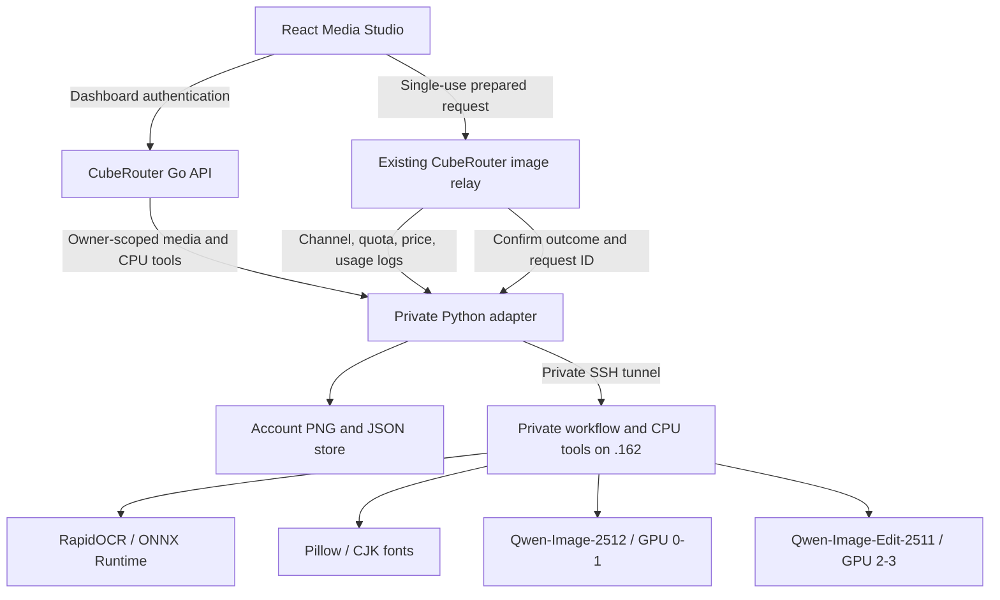

# Media Studio integration runbook

Updated 2026-09-17. Local branch `codex/image-studio-integration`, based on `origin/media-studio` / PR #96. This document describes the running development integration, not a production deployment or published PR.

## User flow

`/media-studio` is native CubeRouter React UI, using its theme, navigation and login. It brings over the .162 template gallery (including animals/stickers), prompt customization, T2I, 1–3 references, 1–4 outputs, seed/CFG/steps, history, download, continuation from generated images, regional masks, OCR comparison and exact text layout. Each save creates a version. Input-command examples/output JSON omit service secrets.

OCR runs automatically within create/edit workflows and is advisory. No-text pictures are not failed generations. The existing worker may attempt one bounded repair per output; original/candidate comparisons are retained. OCR cannot prove that every word or requested detail is correct. Exact text layout uses fonts/Pillow. Regional editing generates a candidate then composites the selection into the original; it is not native masked diffusion. Original, saved composite and full candidate are shown for review.

## Architecture



| Component | Development endpoint |
| --- | --- |
| React / browser | `http://127.0.0.1:5173/media-studio` |
| Go backend | `127.0.0.1:3000` |
| Private adapter | `127.0.0.1:18163` |
| SSH forward | Local `18162` → .162 loopback `8002` |
| Private gateway | .162 `127.0.0.1:8002`, `cuberouter-image-gateway-20260917` |
| Private workflow/tools | .162 `127.0.0.1:8191`, `cuberouter-image-tools-20260917` |
| Existing GPU models | .162 `8188` T2I / `8189` edit, two C500 cards each |
| Original public demo | Remains separate on .162 port 80 / 8000 |

No additional GPU model was loaded. The private gateway/tools are CPU-only and currently use the legacy `meitu-metax:v1` Python runtime. **Both GPU model services use the official Metax Diffusers image.** Do not confuse the CPU tools runtime with model inference.

## Code, packages and storage

| Item | Location |
| --- | --- |
| Native UI, forms, editor and gallery | `web/src/features/media-studio/` |
| Generated gallery examples | `web/public/media-studio/templates/` |
| Authenticated API / relay wrapper | `controller/media_studio.go`, `service/media_studio.go`, routers |
| Account adapter | `scripts/qwen_image_bridge/bridge.py`, `studio.py` |
| Local account files | `D:\suanova\local\cuberouter-dev\data\media-studio\{userId}\` |
| Local CubeRouter DB | `D:\suanova\local\cuberouter-dev\data\cuberouter.db` |
| Existing .162 worker source | `/home/ubuntu/qwen-image-workflow-20260916/` |
| Local worker source copy | `D:\suanova\projects\HKBN\work\qwen-image-workflow-20260916\` |
| Private remote workflow/jobs/masks | `/data/cuberouter-image-tools-20260917/` |
| Shared OCR dependencies / fonts | `/data/qwen-image-tools-20260916/deps/`, `/data/qwen-image-tools-20260916/fonts/` |

UI packages: existing React, TanStack Query, React Hook Form/Zod, Axios and CubeRouter components; a native canvas implements rectangle/lasso/brush selection. No third-party editor plugin is needed. The adapter is Python standard library only. Verified CPU dependencies: RapidOCR 3.9.2, ONNX Runtime 1.23.2, Pillow 11.2.1, NumPy 1.26.4 and OpenCV. Inference remains in existing Diffusers/Metax services. Model weights, worker source/runtime and fonts are deployment prerequisites, not bundled with the CubeRouter checkout.

Saved history belongs to the authenticated account on the server, so browser refresh does not lose it. Browser blob URLs are temporary display handles. Old public demo history is not imported into accounts. No CubeRouter schema or migration is added.

## API and accounting

1. Upload images through CubeRouter; the Go API supplies the owner. Public asset IDs map to private model assets.
2. Prepare validated prompt/settings/references/mask. Submit its exact one-use body through `/pg/images/generations/studio`.
3. Existing channel selection, groups, quota reservation, consumption/refund and Usage Logs apply. The channel must point to the configured studio adapter. There is no second wallet in the worker.
4. Poll the saved job, then fetch completed files through authenticated CubeRouter routes. Cross-account access, private settlement endpoints, altered bodies and replay are rejected.

See [adapter setup and API contract](../scripts/qwen_image_bridge/README.md). Dashboard access tokens authenticate this UI; channel keys are server configuration. Secrets and local login remain outside Git under `D:\suanova\local\cuberouter-dev\`.

Pricing uses the existing model/size/quality/count mechanism. The adapter derives quality from steps (fast ≤20, standard ≤40, high >40). Configure agreed base image prices and applicable modifiers in CubeRouter. **Both image model prices are zero in this isolated development DB.** Real requests/logs were verified; that does not establish a production tariff.

Automatic OCR and at most one repair attempt per image are included in one workflow's image price. A repair using the edit model can consume extra GPU time without a separate user charge. Standalone OCR, text previews and typesetting are unbilled CPU tools; saved text edits are in studio history, not token-consumption logs. Any separate CPU billing policy must be added explicitly.

Completed GPU jobs retain their CubeRouter request ID for Usage Logs; private state retains remote workflow IDs for operators. Automatic retry is disabled because a timeout may still have executed on the GPU. If a charge succeeds but result-release confirmation fails, reconcile by job/request ID; do not blindly regenerate or charge twice. The current system is one adapter with file persistence, not an atomic distributed transaction or durable queue.

## Start / rollback locally

```powershell
& D:\suanova\local\cuberouter-dev\start-detached.ps1
& D:\suanova\local\cuberouter-dev\start-detached.ps1 -ImageBridgeOnly
```

These external scripts launch hidden processes and record PIDs/logs outside Git; no Windows service or scheduled task is created. The adapter README lists portable environment/channel settings. Point the tunnel at the private gateway. Remove `MEDIA_STUDIO_BRIDGE_URL` and restart Go to restore the basic PR #96 UI, preserving account media. Restart only after active work finishes; interrupted jobs are not replayed.

## Production prerequisites

- **Raw media isolation:** CubeRouter APIs/history/account copies are isolated, but raw model storage is still shared with the old public demo. Restrict/retire its raw media endpoints before accepting private customer material. UUID secrecy is not sufficient access control.
- **All-copy retention:** 30-day expiration/deletion currently governs account copies only. Add coordinated cleanup for raw model attempts, uploads, remote workflow state and backups, according to the agreed product policy.
- **Replicas/channels:** use private S3-compatible storage, a shared asset ownership registry, short-lived downloads and durable job scheduling. User files cannot depend on a Windows disk or whichever GPU node served a request.
- **Settlement recovery:** add durable idempotent reconciliation covering crashes between generation, accounting and media release. The development callback holds unconfirmed files but does not automatically repair distributed failures.
- **Capacity:** add per-account upload/tool rate limits, queue limits, channel-aware scheduling and operational metrics. The adapter currently serializes GPU requests even though two models are resident.
- **Costs:** agree T2I/edit/batch/repair tariffs and show a numeric estimate from CubeRouter pricing before submit. The current UI explains billing but has no numeric estimate; CPU work is free.
- **Capabilities:** align content handling with CubeRouter policy. Web search/reference retrieval is not enabled; it needs a separate authenticated tool/provider workflow with source provenance.

## Validation

Real local → CubeRouter → .162 checks on 2026-09-17: T2I 21.9 s GPU, image edit 29.2 s GPU, regional edit 56.6 s GPU, plus CPU text preview/save. These are single smoke tests, not performance benchmarks. All three GPU requests appeared under the expected models/channels in Usage Logs. Regional changed pixels stayed inside the selected rectangle. History survived refresh. Automated tests cover ownership, replay, release, lifecycle and UI contracts; run the adapter README commands before submission.
