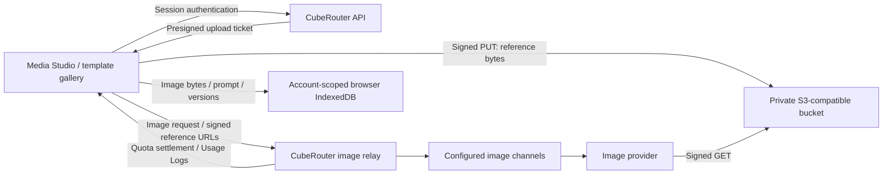

# CubeRouter Media Studio

Media Studio at `/media-studio` uses CubeRouter image channels. The application no longer embeds a node-specific Python workflow, SSH tunnel or additional Compose stack. Normal CubeRouter deployment is sufficient for text-to-image; references require the object-store configuration below.

## Request and storage flow



- Text-to-image uses `POST /pg/images/generations`; editing uses `POST /pg/images/edits`. Both share the existing `PlaygroundImage` handler, channel selection, quota reservation/settlement and logs. This PR does not add another accounting callback, wallet, database schema or server image-history store.
- The model selector uses `/api/pricing` image-generation endpoint metadata. Edit models are the intersection of that available list and the operator-confirmed `MEDIA_STUDIO_EDIT_MODELS` list. The UI does not guess editing support from a model's name.
- Edit requests use the JSON image-edit contract: `images: [{"image_url": "<signed GET URL>"}]`. Only register a model for editing after verifying its channel supports that protocol. Multipart-only or custom workflow APIs need a provider-side adapter outside this repository.
- The page waits for a synchronous image response. It shows elapsed time, the submitted command and result metadata. It does not display invented denoising progress. The frontend does not automatically resubmit a paid request; the backend retains the existing channel retry policy. After a timeout, check Usage Logs before retrying; refresh does not resume a server job in this version.
- Templates, one to three references, one to four outputs, download, generated-image continuation, original/edit comparison and local history are supported. Size/count support still depends on the provider. Seed, steps and CFG are opt-in extensions; they are omitted from generic requests by default.
- OCR, automatic correction, regional masks and text-layout CPU tools from the internal demo are not exposed in this version. These need an explicit provider/tool contract; there is no claim that ordinary image channels support them.

## Browser history

`web/src/features/media-studio/lib/studio-storage.ts` stores completed creations in `cuberouter-studio-{userId}` IndexedDB databases. Each version contains its prompt/settings, reference image bytes, output image bytes and request ID when returned. Account changes remount the studio and use a separate history cache. A saved edit retains its own references if the parent entry is deleted.

Existing internal-demo/account-adapter histories are not automatically imported; those external stores are unchanged by this PR.

The store keeps at most 50 creations or approximately 100 MB of serialized data, evicting oldest entries. It has no cross-device synchronization or guaranteed retention period. Browser storage may be cleared or evicted; users should download important images. This is local display separation, not encryption against somebody with access to the same browser profile.

Base64 results are stored directly. HTTP(S) results are downloaded in the browser without CubeRouter credentials; the provider must permit browser CORS for persistence. A failed download or IndexedDB write does not turn a successful generation into a provider failure: the current result stays visible with an explicit download warning. Temporary signed URLs are not stored as durable history. Deleting history removes browser copies only, not provider records, uploaded objects or usage logs.

## Configure reference uploads and editing

The authenticated routes are `GET /api/media-studio/config` and `POST /api/media-studio/uploads/presign` (also available under existing API version aliases). The presign route uses the existing per-user critical-action rate limiter. Request JSON contains only `content_type` and `size`; object ownership comes from the session.

Configure the CubeRouter server:

| Environment variable | Value |
| --- | --- |
| `MEDIA_STUDIO_S3_ENDPOINT` | HTTPS S3-compatible origin, e.g. `https://objects.example.com`; no bucket/path/query/userinfo |
| `MEDIA_STUDIO_S3_BUCKET` | Existing private bucket |
| `MEDIA_STUDIO_S3_REGION` | Signing region, e.g. `us-east-1` |
| `MEDIA_STUDIO_S3_ACCESS_KEY` | Server-side key restricted to the upload prefix |
| `MEDIA_STUDIO_S3_SECRET_KEY` | Corresponding secret; never sent to the browser |
| `MEDIA_STUDIO_EDIT_MODELS` | Comma-separated model names verified to support the JSON edit contract |

The signer uses the existing AWS SDK dependency, path-style bucket URLs and long-lived server credentials. HTTP is accepted only for literal loopback addresses in local development. The bucket must be reachable by both the browser and the selected image provider.

Each upload gets a random object key under `media-studio/uploads/{userId}/`. A PUT URL is valid for 5 minutes and binds the declared content type and exact byte length (1 byte–10 MB). PNG, JPEG and WebP are accepted. The browser supplies `Content-Type`; it supplies `Content-Length` automatically from the Blob. Do not change these signed headers at a proxy. The matching signed GET URL lasts one hour. Signed URLs are bearer capabilities: keep them out of analytics and application logs. No public bucket ACL is required.

Object-store setup is separate from deploying the application:

1. Grant the server key only `PutObject` and `GetObject` within the upload prefix. The application does not require bucket listing or public access.
2. Configure bucket CORS for the exact CubeRouter frontend origin, methods `PUT` and `GET`, and the `Content-Type` request header. This also applies to a local review origin.
3. Configure bucket lifecycle deletion for `media-studio/uploads/`, for example after one day. URL expiry does **not** delete an object. This PR does not create or modify your bucket, IAM policy, CORS or lifecycle rules.
4. Add the ordinary image channels, model metadata, user groups and pricing in CubeRouter. Confirm that edit channels can fetch the signed reference URLs.
5. Generate an image, reload local history, continue editing it, then check the associated CubeRouter Usage Logs. Verify quota behavior and actual output against the selected provider before publishing the test service.

Without valid object-store settings, text-to-image remains available and editing shows that uploads need configuration. No infrastructure addresses or deployment credentials are included in this repository. The internal demo remains a separate service; its public web page is not a channel API endpoint.

## Code and dependencies

| Area | Source |
| --- | --- |
| Gallery, composer, results and local history UI | `web/src/features/media-studio/` |
| Template preview assets | `web/public/studio-templates/` |
| Upload/config API | `controller/media_studio_upload.go` |
| S3 signing and configuration validation | `service/media_studio_upload.go` |
| Standard generation/edit relay | `controller/playground.go`, `router/relay-router.go` |

UI dependencies are the existing React, TanStack Query, React Hook Form/Zod and native IndexedDB/FileReader/fetch APIs. S3 signing uses the repository's existing AWS SigV4 signer. No new production dependencies or GPU models are required.

## Review and validation

This revision follows the maintainer's PR #103 direction to list channel models, store creations in browser IndexedDB and use presigned reference uploads. Adapter-specific settlement, raw-media exposure and bearer-over-cleartext paths have been removed; their tests were replaced with tests of the new contracts. Empty numeric fields remain editable and prevent invalid submission. Simplified Chinese labels use simplified characters.

Run:

```sh
cd web
bun run test src/features/media-studio
bun run typecheck
bun run build
cd ..
go test ./service ./controller ./relay/constant -run 'TestStudio|TestPath2RelayMode' -count=1
go build ./...
```

The automated tests use real browser-storage emulation and the AWS signer; external uploads and image-provider responses are mocked. Real S3/provider round-trip verification requires the deployment-specific bucket and channel configuration above. Local tests do not establish that `test.cuberouter` is deployed or that any particular GPU provider is configured.
