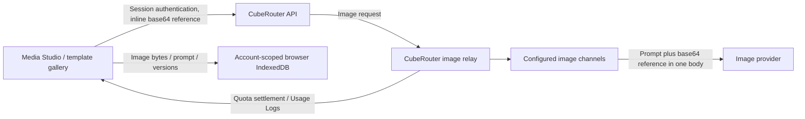

# CubeRouter Media Studio

Media Studio at `/media-studio` uses CubeRouter image channels. The application no longer embeds a node-specific Python workflow, SSH tunnel or additional Compose stack. Normal CubeRouter deployment is sufficient for text-to-image, and for editing, which sends the reference image inline as base64.

## Request and storage flow


```mermaid
flowchart LR
    Browser[Media Studio / template gallery] -->|Session authentication, inline base64 reference| API[CubeRouter API]
    API -->|Image request| Relay[CubeRouter image relay]
    Relay --> Channels[Configured image channels]
    Channels -->|Prompt plus base64 reference in one body| Provider[Image provider]
    Relay -->|Quota settlement / Usage Logs| Browser
    Browser -->|Image bytes / prompt / versions| Local[Account-scoped browser IndexedDB]
```

- Text-to-image uses `POST /pg/images/generations`; editing uses `POST /pg/images/edits`. Both share the existing `PlaygroundImage` handler, channel selection, quota reservation/settlement and logs. This PR does not add another accounting callback, wallet, database schema or server image-history store.
- The model selector classifies `/api/pricing` models by the operator-declared model-metadata labels `text-to-image` and `image-to-image` (see below). Endpoint metadata and model names no longer take part: a model's name cannot distinguish generation from editing. The UI does not guess image capability.
- Edit requests inline the reference as base64: `image: "<data URL>"` for one reference, `image: ["<data URL>", …]` for several. The reference already lives in the draft as a data URL, so no upload, object-store round trip or provider-side fetch is involved. Multipart-only providers and providers that fetch a URL themselves need a provider-side adapter outside this repository.
- References are downscaled before they are sent. Anything longer than 1024 px on the long edge is scaled down and re-encoded — WebP at quality 0.9, or JPEG at 0.9 on a white matte where the browser has no WebP encoder, or a resized PNG where neither lossy encoder answers. The edit model resizes every input to roughly a 1 MP area before it encodes it, so that detail was never used: a 4032×3024 phone photo drops from about 13 MB of base64 to a few hundred KB, and a three-reference request from tens of MB to about 1 MB, which keeps it clear of the ingress `proxy-body-size`. This happens at send time only — the draft and the browser history keep the original bytes, so the original/edit comparison, the stored local history and the downloaded originals are unaffected, and re-sending the same draft encodes the same pristine bytes. Every failure path returns the original bytes: an undecodable image, a re-encode that came out larger, or a browser with no 2D canvas at all all send what was uploaded. The one residual gap is that last case — a browser with no canvas support cannot shrink a genuinely oversized reference, so the ingress body limit can still answer `413` and the user sees a generic server error.
- Editing is served by its own channel type, **Image Edit (Base64)** (63, `relay/channel/imageedit/`), which owns that contract. It rejects an `images: [{"image_url": …}]` payload, an `http(s)` URL in `image` and multipart edits with `400` rather than forwarding them, because an upstream that base64-decodes `image` unconditionally answers those with a cryptic `Incorrect padding` or attribute error. Use the ordinary OpenAI channel type for providers that really do accept JSON image edits with remote URLs.
- The page waits for a synchronous image response. It shows elapsed time, the submitted command and result metadata. It does not display invented denoising progress. The frontend does not automatically resubmit a paid request; the backend retains the existing channel retry policy. After a timeout, check Usage Logs before retrying; refresh does not resume a server job in this version.
- Templates, one to three references, one to four outputs, download, generated-image continuation, original/edit comparison and local history are supported. Size/count support still depends on the provider. Seed, steps and CFG are opt-in extensions; they are omitted from generic requests by default.
- OCR, automatic correction, regional masks and text-layout CPU tools from the internal demo are not exposed in this version. These need an explicit provider/tool contract; there is no claim that ordinary image channels support them.

## Browser history

`web/src/features/media-studio/lib/studio-storage.ts` stores completed creations in `cuberouter-studio-{userId}` IndexedDB databases. Each version contains its prompt/settings, reference image bytes, output image bytes and request ID when returned. Account changes remount the studio and use a separate history cache. A saved edit retains its own references if the parent entry is deleted.

Existing internal-demo/account-adapter histories are not automatically imported; those external stores are unchanged by this PR.

The store keeps at most 50 creations or approximately 100 MB of serialized data, evicting oldest entries. It has no cross-device synchronization or guaranteed retention period. Browser storage may be cleared or evicted; users should download important images. This is local display separation, not encryption against somebody with access to the same browser profile.

Base64 results are stored directly. HTTP(S) results are downloaded in the browser without CubeRouter credentials; the provider must permit browser CORS for persistence. A failed download or IndexedDB write does not turn a successful generation into a provider failure: the current result stays visible with an explicit download warning. Temporary signed URLs are not stored as durable history. Deleting history removes browser copies only, not provider records, uploaded objects or usage logs.

## Object-store reference uploads (retained, not used by the current UI)

Reference images are inlined as base64, so the current Media Studio UI never calls the upload API and never needs an object store. The upload surface is deliberately kept in the product so a future direct-upload path (for example to keep large references out of the relay body) can be switched on without redesigning it: the routes, the server-side signer, the environment variables, the chart values and their tests all still ship and still work. Nothing below is required to deploy Media Studio; skip it unless you intend to use the presign endpoint directly.

The authenticated routes are `GET /api/media-studio/config` and `POST /api/media-studio/uploads/presign` (also available under existing API version aliases). The presign route uses the existing per-user critical-action rate limiter. Request JSON contains only `content_type` and `size`; object ownership comes from the session.

Configure the CubeRouter server:

| Environment variable | Value |
| --- | --- |
| `MEDIA_STUDIO_S3_ENDPOINT` | HTTPS S3-compatible origin, e.g. `https://objects.example.com`; no bucket/path/query/userinfo |
| `MEDIA_STUDIO_S3_BUCKET` | Existing private bucket |
| `MEDIA_STUDIO_S3_REGION` | Signing region, e.g. `us-east-1` |
| `MEDIA_STUDIO_S3_ACCESS_KEY` | Server-side key restricted to the upload prefix |
| `MEDIA_STUDIO_S3_SECRET_KEY` | Corresponding secret; never sent to the browser |

On Kubernetes, set these through the Helm chart instead of raw environment variables:
`mediaStudio.enabled` plus `mediaStudio.s3.endpoint` / `.bucket` / `.region` / `.access_key` /
`.secret_key` in `helm/cuberouter-chart/values.yaml`. The chart routes the first three into its
ConfigMap and the two credentials into its Secret, injected via `secretKeyRef`, and refuses to render
a malformed configuration rather than disabling uploads silently. See the chart README's
"Media Studio reference uploads".

The signer uses the existing AWS SDK dependency, path-style bucket URLs and long-lived server credentials. HTTP is accepted only for literal loopback addresses in local development. The bucket must be reachable by both the browser and the selected image provider.

Each upload gets a random object key under `media-studio/uploads/{userId}/`. A PUT URL is valid for 5 minutes and binds the declared content type and exact byte length (1 byte–10 MB). PNG, JPEG and WebP are accepted. The browser supplies `Content-Type`; it supplies `Content-Length` automatically from the Blob. Do not change these signed headers at a proxy. The matching signed GET URL lasts one hour. Signed URLs are bearer capabilities: keep them out of analytics and application logs. No public bucket ACL is required.

Object-store setup is separate from deploying the application:

1. Grant the server key only `PutObject` and `GetObject` within the upload prefix. The application does not require bucket listing or public access.
2. Configure bucket CORS for the exact CubeRouter frontend origin, methods `PUT` and `GET`, and the `Content-Type` request header. This also applies to a local review origin.
3. Configure bucket lifecycle deletion for `media-studio/uploads/`, for example after one day. URL expiry does **not** delete an object. This PR does not create or modify your bucket, IAM policy, CORS or lifecycle rules.
4. Add the ordinary image channels, model metadata, user groups and pricing in CubeRouter. Confirm that edit channels accept the reference as an inline base64 image in `image`.
5. Generate an image, reload local history, continue editing it, then check the associated CubeRouter Usage Logs. Verify quota behavior and actual output against the selected provider before publishing the test service.

Object-store settings are not required for editing, and their absence no longer disables anything in the UI. No infrastructure addresses or deployment credentials are included in this repository. The internal demo remains a separate service; its public web page is not a channel API endpoint.

## Declaring image capability with labels

The model selector reads the **Tags** field on the Model Metadata page (`/models/metadata`). Two labels are recognised:

| Label | Meaning | Media Studio mode | Relay |
| --- | --- | --- | --- |
| `text-to-image` | prompt produces an image | Text to image | `POST /pg/images/generations` |
| `image-to-image` | prompt plus a reference produces an image | Image to image | `POST /pg/images/edits` |

Labels are comma-separated, matched as whole items and case-insensitively, so `text-to-imagex` is not `text-to-image`. A model carrying neither label never appears in Media Studio.

- `text-to-image` also adds the `image-generation` endpoint type to `/api/pricing` and `/v1/models`, first in the list, so the pricing page and channel test dialog pick the image example.
- `image-to-image` adds **no** endpoint type. There is no edit endpoint type; edit requests are relayed by path. Advertising one would present an edit-only model as a generator, and `/v1/images/generations` fails upstream for it.
- A model tagged `image-to-image` still needs a channel that understands the inline-base64 contract. Channel selection is by model name as usual; the **channel type** decides the wire format, so put the model on an **Image Edit (Base64)** channel (63) unless its provider genuinely accepts JSON edits with remote URLs.
- Tag edits take effect immediately; model metadata writes refresh the pricing cache.
- **Use an exact-name metadata row.** A row with a prefix/contains/suffix matching rule applies its label to every model it matches. A *contains* row on `qwen-image` tagged `text-to-image` would label both `qwen-image-2512` and `qwen-image-edit-2511` and reintroduce exactly the failure these labels prevent.
- A model with no metadata row cannot carry a label.

Migration: the previous `qwen-image` name heuristic is gone and `MEDIA_STUDIO_EDIT_MODELS` is no longer read. Label your text-to-image models **before** deploying, otherwise they leave Media Studio and lose the `image-generation` endpoint type. Ship the frontend and backend together: in between, the old frontend no longer sees `image-generation` for models that only the name heuristic used to provide it.

## Code and dependencies

| Area | Source |
| --- | --- |
| Gallery, composer, results and local history UI | `web/src/features/media-studio/` |
| Template preview assets | `web/public/studio-templates/` |
| Upload/config API (retained, unused by the UI) | `controller/media_studio_upload.go` |
| S3 signing and configuration validation (retained, unused by the UI) | `service/media_studio_upload.go` |
| Kubernetes configuration for the above | `helm/cuberouter-chart/values.yaml` (`mediaStudio.*`) |
| Inline-base64 edit adaptor | `relay/channel/imageedit/` |
| Standard generation/edit relay | `controller/playground.go`, `router/relay-router.go` |

UI dependencies are the existing React, TanStack Query, React Hook Form/Zod and native IndexedDB/FileReader/fetch APIs. S3 signing uses the repository's existing AWS SigV4 signer. No new production dependencies or GPU models are required.

## Review and validation

This revision follows the maintainer's PR #103 direction to list channel models and store creations in browser IndexedDB, and inlines edit references as base64 so no object store is needed. The presigned-upload route and its configuration are kept working but are no longer on the request path. Adapter-specific settlement, raw-media exposure and bearer-over-cleartext paths have been removed; their tests were replaced with tests of the new contracts. Empty numeric fields remain editable and prevent invalid submission. Simplified Chinese labels use simplified characters.

Run:

```sh
cd web
bun run test src/features/media-studio
bun run typecheck
bun run build
cd ..
go test ./relay/channel/imageedit ./constant ./common -count=1
go test ./service ./controller ./relay/constant -run 'TestStudio|TestPath2RelayMode' -count=1
go test ./common ./model -run 'TestQwenImageName|TestHasModelTag|TestPricingModelTag' -count=1
go build ./...
```

The automated tests use real browser-storage emulation and the AWS signer; external uploads and image-provider responses are mocked. Real S3/provider round-trip verification requires the deployment-specific bucket and channel configuration above. Local tests do not establish that `test.cuberouter` is deployed or that any particular GPU provider is configured.

The adaptor tests pin the wire contract — which shapes are forwarded and which are rejected with `400` — but they cannot prove what one deployed provider accepts. Both shapes were verified against the GPU provider in use at the time of writing: a single reference (`image: "<base64>"`) and two references (`image: ["<base64>", "<base64>"]`) each returned `200`. Re-check a new provider before relying on it: send a two-image request and confirm it answers `200` rather than an `Incorrect padding` decoding error. Multi-reference edits are also markedly slower — a two-image run took 275 s against the 40 s–5 min the UI quotes, so keep `GENERATION_TIMEOUT_MS` (10 min) generous.
